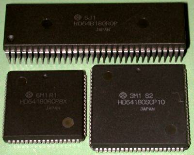

# HD64180

> 出典: http://www.st.rim.or.jp/~nkomatsu/hitachi/HD64180.html

日立のマイクロコンピュータ事業は、Intel社のセカンドソースから始まりました。4004をHMCS-4シリーズとして生産していたのです。その後、MotorolaのMC6800のセカンドソースに参入し、そこからは8 bitマイクロプロセッサのHD46800から16 bitのHD68000と、中心となるマイクロプロセッサに関してMotorolaのマイクロプロセッサのセカンドソース供給を行うとともに、CRTCなど優れたMC6800/MC68000ファミリLSIを開発し供給していました。

そんな中、1984年になって意外な製品が発表されました。HD64180シリーズです。Z80の上位互換のCPUをCMOSプロセスで新規設計して、さらにMMUとDMACとシリアルインターフェースとMC6800の周辺LSIとのインターフェース信号を組み込んだチップです。追加された新命令には8 bit同士の乗算命令まで含まれます。CMOSで低消費電力、動作中に触っても熱くないZ80互換チップで感激しました(私が手に入れて使用していた頃にはすでに東芝やNECからCMOS版のZ80が発売されて入手できるようになっていたはずですが、私は使っていませんでした)。日立はこのCPUを「CP/M-80互換CPU」というような呼び方をしていました。Z80 CPU上位互換などと宣伝してZilog社とトラブルを起こしたくなかったのでしょう。最近のWindowsマーク入りCPUみたいな表現ですね。

実際に出荷が始まったのが1985年の半ばでしょうか。初期のアナウンスでは4, 6, 8 MHzの各クロック周波数バージョンが存在して、出荷されたのがHD64A180とHD64B180だったので、無印がきっと4 MHzでAが6、Bが8 MHzのものだろうと思って8 MHzクロックで試作をしてからHD64A180が4 MHz版でHD64B180が6 MHz版ということを知ったという間抜けなことをしてしまいました。

内蔵のMMUによってメモリ空間を512 KByteか1 MByte(パッケージによって異なる)に拡張できます。当時は256 Kbit D-RAMが旬の時期でしたから、ちょうど良いアドレス空間でした。Z80 CPUと異なり、リフレッシュカウンタを拡張してありましたから、256 Kbit D-RAMのリフレッシュも行えます。

上はHD64B180R0Pで6 MHzクロック、512 KByteのメモリ空間をサポートしています。左下のLSIは改良版のR1マスクで8 MHzクロック動作を保証している上に、68ピンパッケージでA19端子が外部に引き出されていて1 MByteのメモリ空間をサポートしているHD64180RCP8Xです。右下はさらに通信機能を強化した10 MHzクロック動作のHD64180SCP10です。

初期のHD64180のRマスクについて内部に組み込まれている周辺機能を少し詳しく見ていきます。

まずクロックジェネレータが内蔵されました。プロセッサの動作クロックの2倍の周波数の水晶発振子とコンデンサを接続して、動作に必要なクロックを生成できます。Z80 CPUではクロック入力の電圧レベルや入力容量の都合でクロック信号の駆動が面倒だったのが簡単になりました。

調歩同期式の通信インターフェースは2 ch内蔵されています。ピン数の都合で、他と共用している信号もありますが、モデム制御用の信号も用意され(ch 0にはDCD\*, CTS\*, RTS\*、ch 1にはCTS\*のみ)、ビットレートジェネレータも内蔵されていますし、Motorola社のシングルチップ製品とも互換性のある形でマルチドロップ機能を効率良く実現するための第9番目のデータビットの送受信も可能となっています。例えばHD64B180の場合、12.288 MHzの水晶でクロックを生成していれば、電圧レベルを変換するためのインターフェースICを外付けするだけで、他の内蔵ブロックの補助も必要なくモデムなどを接続できます。

シリアルインターフェースには、この他にシフトレジスタ式というかクロック同期式のポートも1回路内蔵されています。

タイマも16 bit幅のリロード機能付きのものが2回路内蔵されています。クロック周波数を20分周したものがタイマの入力となり、それによって決まる分解能で時間計測や周期的割り込み発生が可能です。ch 1のタイマについては出力端子も用意されていますが、この端子はアドレス出力端子A18と兼用されていたり、問題も多いので、使わない方がよいでしょう。

さらにDMAインターフェースが2 ch分内蔵されています。このDMAは内蔵MMUのアドレス変換機能をパスして物理アドレス空間を直接指定する形で動作します。メモリ-I/O間転送はもちろん、メモリ-メモリ間のブロック転送にも使用可能で、さらに内蔵の調歩同期シリアルインターフェースの送受信に利用することも可能です。DMA転送は1サイクルを6クロックで実行されるため、6 MHzクロックのとき1 MByte/sの転送速度で動かすことができます。

内蔵のMMUは、バンク切り替え機構に毛の生えたような簡単なものですが、アドレス空間の拡大に役に立ちますし、似たようなものを外付けにしたのと比べるとずっと回路的にも簡単ですしメモリアクセスタイミングへの悪影響も考える必要もなく便利です。内部回路的には、CPUがメモリをアクセスする場合には必ずMMUが使用されることになっていてバイパスできませんが、リセット直後はプロセッサの論理アドレスがそのまま物理アドレスに変換されるようにMMUの制御レジスタが初期化されますので、メモリ空間の拡張が必要なければ、何もしなくてもかまいません(初期値と同じものをコールドスタート時には上書きした方が良いでしょうが)。初期化の方式からわかるように、HD64180はリセット後に物理アドレス0からプログラムを読み出して実行しますので、普通は物理アドレス0からROMを配置する必要があります。そうして、リセット直後から動作するプログラムで各種初期化作業を行なったあとで、MMUを適切に設定すれば、プロセッサの論理アドレス空間0からほとんどの領域をRWMに割り当てて、論理アドレス0F000Hから始まる4 KByteだけをMMUの操作やI/Oハンドラのコードを記憶したROMの一部に割り当てるようなことも可能で、CP/M系のオペレーティングシステムの実行にも適しています。

割り込みコントローラとウェイトステートコントローラも内蔵されています。割り込みコントローラは通信インターフェースやタイマなどの内蔵I/Oからの割り込みのほか、INT1\*とINT2\*という割り込み要求信号についても、優先順位付きの調停を行うとともに割り込みベクタの生成も行ってくれます。

ウェイトステートコントローラは、メモリとI/Oアクセス別々に、0から3ウェイトのウェイトサイクルを挿入するようにプログラムできます。もちろんWAIT\*信号も用意されていて、外部回路から任意のウェイトサイクルを挿入することもできます。M1サイクルだけウェイトステートを挿入したいというような場合には、外部回路の助けを借りる必要があります。

リフレッシュコントローラはダイナミックメモリのリフレッシュサイクルをM1サイクルから独立させるために付加されました。リフレッシュサイクルを挿入するかしないか、リフレッシュサイクルにウェイトを1サイクル追加するかどうか、何クロックごとにリフレッシュサイクルを挿入するかを、プログラムできます。つまり、ダイナミックメモリを使わない場合は最初からリフレッシュサイクルを使用しない設定にもできますし、リフレッシュのタイミング関係も限定的ながらプログラマブルになっています。

プロセッサにも機能が付け加えられています。レジスタセットの方には変更ありませんが、命令が新設されています。新しい命令は次の10命令です。

* IN0
* OUT0
* OUTDM
* OUTDMR
* OUTIM
* OUTIMR
* TSTIO
* MLT
* TST
* SLP

このうち、IN0からTSTIO命令まではHD64180に内蔵されたI/Oポートをアクセスして初期設定などを行いやすくするために用意された命令です。これらの命令では、I/Oアドレス送出時にアドレスバスの上位8 bit、つまりA8からA15までに0を出力します。一般にZ80 CPUのI/O命令では、アドレスバスの上位8 bitにアキュムレータの内容とかBレジスタの内容が出力されています。これは4004, 8008, 8080と続くIntel系列マイクロプロセッサの伝統みたいなものですが、本来は下位8 bitだけに有効なI/Oアドレスを出力すれば良いのですが、その際に空いている上位8 bitのアドレスバスに何かしら意味のある内部情報を送出して、デバッグか何かに役立てようという考え方から始まっています。Z80 CPUの場合には、I/Oアドレス空間を16 bit幅に拡大するために利用されることがよくありました。HD64180の内蔵I/Oレジスタ類は、なんと16 bitアドレスをフルデコードして、上位8 bitが0のページに割り当てられています。そのため、Z80 CPU由来のI/O命令を使用すると、A, Bレジスタの内容によって内蔵I/Oレジスタにアクセスできないという問題が生じます。そのため、これらの新設I/O命令については、必ずアドレスバス上位8 bitに0を送出することで、内蔵I/Oレジスタを確実にアドレスできるようにしています。なおTSTIO命令はCレジスタでアドレス指定されたI/Oポートの内容とイミディエート指定されたデータとのANDを取ってフラグを設定するテスト命令です。フラグ以外のプロセッサのレジスタの内容は変化しません。

MLT命令はBC, DE, HL, SPレジスタペアのどれかをオペランドに取り、上位バイトと下位バイトの無符号乗算を行って、その結果を同じレジスタペアに戻す命令です。17クロックと、レジスタ間加算の4倍程度の時間で実行されます。フラグはまったく影響を受けません。

TST命令はAレジスタとオペランドのAND演算を行ってフラグをセットするものです。Aレジスタなどフラグ以外は変化しません。オペランドはA - Lレジスタ、(HL)、8 bit定数を選べます。

SLP命令はプロセッサをスリープモードに遷移させる命令です。

内蔵レジスタのおおまかなレイアウトはこのようになっています。

|アドレス|機能ブロック|
|--|--|
|00H 09H|ASCI
|0AH 0BH|CSI/O
|0CH 10H|Timer
|11H 13H|--
|14H 17H|Timer
|18H|FRC|
|19H 1FH|--
|20H 2CH|DMA
|2DH|--
|2EH 32H|DMA
|33H 34H|INT
|35H|--
|36H|Refresh
|37H|--
|38H 3AH|MMU
|3BH 3EH|--
|3FH|I/O control

これらのレジスタはI/O空間の下位6 bitが上の表のアドレスに割り当てられています。上位8 bitは00に固定され、第7, 6 bitはI/Oコントロールレジスタによって任意に設定できます。すなわち、プログラムしだいで0000H - 003FH, 0040H - 007FH, 0080H - 00BFH, 00C0H - 00FFHのどれかに配置されることになります。

HD64180のMMU部はバンク切り替え方式とセグメント方式の中間というか、バンク切り替え方式を少しだけ改良したようなものです。そのしくみを説明します。

まずHD64180の論理アドレス空間はZ80 CPUと同じ64 KByteですが、HD64180の論理アドレスのうちの下位12 bitはMMUで処理されずに、そのまま物理アドレスとして出力されます。論理アドレスの上位4 bitだけがMMUで操作されます。つまり4 KByte単位でメモリの再配置が行われます。

そうして、この論理アドレス空間を3ブロックに分割して物理アドレス空間に割り当てます。その3個のブロックは、論理アドレス0から始まるCommon Area 0、その直後から始まるBank Area、さらにその後から論理アドレス0FFFFHまでを覆うCommon Area 1と名付けられています。これらのブロックは、必ずこの順序で論理アドレス空間に配置されます。ただしCommon Area 0とBank Areaについてはブロックサイズを0にすることができ、その場合には論理アドレス空間には存在しないことになります。また、これらのブロックに属さない論理アドレスは存在しません。つまり3ブロックが論理アドレス空間を完全に覆いつくす形でしかブロック分割できません。

Bank AreaとCommon Area 1は先頭論理アドレス(のうちの上位4 bit)を指定できます。Common Area 0は論理アドレス空間の0から始まることに決まっていて、変更はできません。Bank Areaの先頭アドレスを0にすれば、Common Area 0は存在しないことになります。また、Bank AreaとCommon Area 1の先頭アドレスとして同じ値を設定すれば、Bank Areaは存在しないことになります。Common Area 1の先頭アドレスを0に設定すると、論理アドレス空間からCommon Area 0とBank Areaが見えなくなって、すべてがCommon Area 1として扱われます。

同じくBank AreaとCommon Area 1には8 bit幅のオフセット値を指定できます。論理アドレスの上位4 bitと、このオフセット値8 bitが加算されて、物理アドレスの上位8 bitを構成します。物理アドレスの下位12 bitは前述のようにそのまま物理アドレスの下位12 bitとなりますから、全部で20 bit幅の物理アドレスが得られることになります。R0マスクやR1マスクの64 pinパッケージにはアドレスバスの20番目のビットであるA19が存在しませんが、これは単に物理アドレスの最上位ビットが使われていないだけだと考えてかまいません。またA18端子をTOUT信号として使用するように設定もできますが、これもそれに対応して物理アドレス空間が狭くなるだけで、MMUの動作を考える上では無視してかまいません。なお、Common Area 0のオフセット値は0に固定されています。つまりCommon Area 0に属する論理アドレスはそのまま(論理アドレスを越えるA16以上を0にして)物理アドレスに割り当てられます。

これらの設定を行うためのレジスタはHD64180の内蔵I/Oレジスタとして3 Byteを占有しています。

|アドレス|名称|略称|7|6|5|4|3|2|1|0|
|--|--|--|--|--|--|--|--|--|--|--|
|38H|MMU Common Base Register|CBR|CB7|CB6|CB5|CB4|CB3|CB2|CB1|CB0
|39H|MMU Bank Base Register|BBR|BB7|BB6|BB5|BB4|BB3|BB2|BB1|BB0|
|3AH|MMU Common/Bank Area Register|CBAR|CA3|CA2|CA1|CA0|BA3|BA2|BA1|BA0

この3レジスタは読み書き可能で、リセット時にはCA3 - 0(以下CA fieldの意味でCAF)が1になるのを除き、すべて0クリアされます。

CBARのBA3 - 0(以下同じくBAF)がBase Areaの先頭アドレスを指定するフィールドです。逆の見方をすると、この値を1だけ減らしたものがCommon Area 0の末尾となります。BAFが0ならCommon Area 0は論理アドレス空間に割り当てられません。CAFがCommon Area 1の先頭アドレスを指定するフィールドです。この値から1小さいものがBase Areaの末尾アドレスとなります。CAFとBAFが等しい場合、およびCAFの方が小さい場合には、Base Areaは割り当てられなくなります。

BBRがBank Areaのオフセット値を、CBRがCommon Area 1のオフセット値を設定するレジスタです。論理アドレスの上位4 bitとこれらの8 bit値が加算されて物理アドレスの上位8 bitを生成し、物理アドレスの下位12 bitと組み合わされて、全20 bitの物理アドレスが生成されます。このベースレジスタの内容は、各ブロックの先頭アドレスというわけではなく、加算によって物理アドレスが生成されていることに注意が必要です。たとえば、CAFが0FHでCBRに80Hが入っている場合、Common Area 1の先頭物理アドレスは80000Hではなくて8F000Hということになります。物理アドレスが8E000HのメモリはCommon Areaに割り当てられてはいません。BBRやCBRに値を設定する時は、その領域が論理アドレスのどこに配置されるかも考慮して値を決定しなくてはなりません。

リセット時には先に示したような値で初期化されますから、論理アドレス0000Hから0EFFFHまでがBank Areaとして物理アドレス空間の00000Hから0EFFFHまでに配置され、論理アドレス0F000Hから0FFFFHまでがCommon Area 1として物理アドレス空間の0F000Hから0FFFFHまでに割り当てられることになります。Common Area 0は使用されません。結局、論理アドレス0000Hから0FFFFHまでが物理アドレス00000Hから0FFFFHに割り当てられるわけで、MMUによるアドレス変換が存在しないのと同じ状態になっています。

具体的にどのように利用できるか考えてみます。例えば、CP/M系のDOSを利用するシステムを考えてみましょう。物理アドレスの00000H - 07FFFHまでがROM、10000Hから17FFFHまでがビデオRAM、80000Hから0FFFFFHがRWMとします。リセット時には論理アドレス空間の前半がROMで、後半はメモリが存在しない物理アドレス空間が割り当てられています。そこで、CBFに1H、BBRに80H、CAFに0FH、CBRに01Hを設定すると、論理アドレスの0000Hから0FFFHまでがROMの先頭4 KByteに、1000Hから0EFFFHまでがRWMの一部の81000Hから8EFFFHまでに、0F000Hから0FFFFHまでがビデオRWMの先頭4 KByteに割り当てられます。この状態でRWMが割り当てられている論理アドレスの一部にスタックを設定し、DOSをディスクからRWMにロードできます。MMUのレジスタ設定時にROMの先頭4 KByte以内のコードを実行している限り、この設定を行っても論理アドレスと物理アドレスの関係に影響はありませんから、暴走する危険はありません。その後、DOSのコールドブートルーチンでBAFを0に設定すれば、論理アドレスの0000Hから0EFFFHまでが物理アドレスの80000Hから8EFFFHまでに割り当てられることになり、システムのRWMの先頭60 KByteをDOS自身やDOSに管理されたアプリケーションプログラムで自由に使用できるようになります。このレジスタ書き換え時に影響を受けるのは論理アドレス空間の先頭4 KByteだけなので、それ以外の場所にあるはずのDOSのコールドブートルーチンからレジスタを変更する際にも、その時に走っているコードには影響はなく、安全です。(厳密には変更直後にNMIが生じると未初期化領域へのジャンプが生じて危険。変更前に0F000Hから存在する「窓」を利用してそのあたりを初期化しておけば良い。)必要に応じてCBRを変更すれば、論理アドレスの0F000Hから0FFFFHまでの4 KByteをビデオRAMの任意の場所や、ROM内のデータやコードの書き込まれた領域や、未割り当てのRWMに割り当てて、自由にアクセスできます。

以上はCP/M 2.2のようなものを考えていますが、MP/MやCP/M plusのバンクシステムの場合には、Common Area 1をDOSのシステム常駐部に割り当てて、Bank AreaをTPAやRAMディスク領域に適宜割り当てて使用することができます。

ROM前提の組み込みシステムのような場合には、Common Area 0をROMとして32 KByte分くらい割り当てて、Common Area 1をRWMに割り当ててスタックや変数領域に使用し、Bank Areaを随時切り替えて漢字フォントデータROMのようなサイズの大きな固定データROMとかデータバッファとして使用する256 KByteくらいのメモリの一部をアクセスするのに使用できるでしょう。

単純なバンク切り替えをプロセッサ外部に取り付けるのとくらべると、ハードウェアが単純になるのはもちろんですが、ハードウェアから開発する応用システムごとにバンク切り替えの回路や利用法が異なる場合があるかもしれないということを気にせず、プロセッサがHD64180と決まった時点で安心して使えるというのも利点であると言えるでしょう。反面、高機能とはとてもいえないMMUで、プロセッサ側にも特権状態とかの類の機能追加はされていませんから、仮想記憶はもちろんメモリ空間の保護もありません。汎用性を持たせた複数バンク方式といった程度のものです。まぁ、1980年代半ばでは、外付けのバンク切り替え回路に加算器を組み込むようなことはそれなりの覚悟がないとできませんし、単純なバンク切り替えよりも使いやすくはありましたが。

もうひとつ惜しいところに、Waitステートの自動挿入機能が別に用意されていますが、この挿入設定がメモリ空間全体に共通という点があります。できればMMU関係と組み合わせて、各ブロックごとに異なるWait数を指定できればよかったのですが。そうすればCommon Area 0のROMは遅いので1 Wait挿入し、RWMをアクセスするBank Areaは0 Waitで、というようなことが外部回路無しに設定できて便利だったのにと思われます。

HD64180は2 chのDMAコントローラを内蔵しています。プロセッサのプログラム実行とは独立にDMAコントローラによって、基本的にはDREQ0\*/DREQ1\*端子へのDMA要求信号により、指定されたI/Oないしメモリからデータを読み込み、そのデータを指定されたメモリないしI/Oへ書き込むという動作を行います。一般のDMAコントローラでは1回のバスサイクルでI/Oとメモリ間のデータ転送を行う場合が多いのですが、この内蔵DMAコントローラでは2回のバスサイクルにわけてのデータ転送となります。それでもWaitステートが挿入されなければ6クロックでデータ転送が終わるので、6 MHzクロック時に1 MByte/sという転送速度を実現でき、プログラム転送よりははるかに高速のデータ転送を行うことができます。

この2 chのコントローラは同等のものが含まれているわけではなく、ch 0の方が高機能であり、優先順位も高くなっています。ch 0はメモリとI/Oの間の転送だけでなく、メモリ間のブロックデータ転送や、内蔵ASCIとのDMAも可能となっています。ch 1はメモリとI/Oの間のデータ転送に限られます。

アドレス|名称|略称
|--|:--|--|
20H|DMA Source Address Register Ch 0L|SAR0L
21H|DMA Source Address Register Ch 0H|SAR0H
22H|DMA Source Address Register Ch 0B|SAR0B
23H|DMA Destination Address Register Ch 0L|DAR0L
24H|DMA Destination Address Register Ch 0H|DAR0H
25H|DMA Destination Address Register Ch 0B|DAR0B
26H|DMA Byte Count Register Ch 0 L|BCR0L
27H|DMA Byte Count Register Ch 0 H|BCR0H
28H|DMA Memory Address Register Ch 1L|MAR1L
29H|DMA Memory Address Register Ch 1H|MAR1H
2AH|DMA Memory Address Register Ch 1B|MAR1B
2BH|DMA I/O Address Register Ch 1L|IAR1L
2CH|DMA I/O Address Register Ch 1H|IAR1H
2EH|DMA Byte Count Register Ch 1L|BCR1L
2FH|DMA Byte Count Register Ch 1H|BCR1H
30H|DMA Status Register|DSTAT
31H|DMA Mode Register|DMODE
32H|DMA/WAIT Control Register|DCNTL

DMA対象のメモリアドレスは物理アドレスを直接指定するので、20 bitが必要です。そのため、3個のレジスタにわけてアドレスを設定します。たとえば20HからのCh 0のソースアドレスレジスタについては、SAR0Lがアドレス下位8 bit、SAR0Hがアドレスのビット15から8までの8 bit、SAR0Bが上位4 bitの設定に使用されます。なお、これらの3レジスタをまとめて考える場合には、SAR0のように表記することにします。

アドレス2DHにはレジスタが割り当てられていないので、注意して下さい。

Ch 0についてはメモリ・I/O間転送ばかりでなくメモリ・メモリ間転送にも使われますから、SAR0もDAR0も20 bit幅が確保されています。I/Oを指示する場合、I/Oアドレスが16 bitのためにSAR0BやDAR0Bは不要なはずですが、実際にはDMAリクエスト入力指定に使われているので、必ず0を設定しないといけません。内蔵ASCIの送受信をDMAで行う場合には、DREQ0\*端子の代わりにASCIのバッファステータス情報を使用するため、特別な値をSAR0BやDAR0Bに書き込むことがあります。

SAR0やDAR0はDMA転送のたびにインクリメントやデクリメントさせることも、変化させないことも可能なため、データの並び順を反転させたメモリ・メモリ間転送とか、特定の値でメモリブロックをクリアしたり、あるいはメモリマップドI/Oとのデータ転送も可能となります。

BCR0はDMA転送のたびにデクリメントされて、0になるとDMA転送が終了します。n Byteの転送を行う場合にはnを設定します。このレジスタは16 bit幅のため、最大64 KByteのデータ転送が可能です。また、転送アドレス範囲は256 Byte境界とか64 KByte境界とは無関係に設定できます。

MAR1とIAR1はCh 1用のアドレスレジスタです。Ch 1はメモリ・I/O間転送しかできませんから、MAR1とIAR1が転送方向によってソースとディスティネーションに変化します。BCR1はBCR0と同じ扱いのバイトカウントレジスタです。

残る三つのレジスタがDMAコントローラの動作モードなどを設定するためのレジスタで、各ビットごとに個別の役割が割り当てられています。

略称|7|6|5|4|3|2|1|0
|--|--|--|--|--|--|--|--|--|
DSTAT|DE1|DE0|DWE1\*|DWE0\*|DIE1|DIE0|--|DME
|DMODE|--|--|DM1|DM0|SM1|SM0|MMOD|--|DCNTL|MWI1|MWI0|IWI1|IWI0|DMS1|DMS0|DIM1|DIM0|

--は未使用ビットです。

DSTATはステータスレジスタということになっていますが、意外にも読み出しのみで意味を持つのはDMEビットのみで、残りはプログラム側から設定するためのビットです。リセット時にはDWE1\*とDWE0\*だけが1になります。

DE1はCh 1の、DE0はCh 0のDMAイネーブルビットです。このビットを1にすれば、対応するチャネルのDMAが動作を始めます。そのとき、DMAメインイネーブルビットのDMEも1にセットされます。Ch 0とCh 1を独立に設定できるように、DE1, DE0にはそれぞれDWE1\*, DWE0\*という鍵となるビットが割り当てられていて、DWE1\*とDWE0\*が0になっているときにのみ、DE1, DE0が変化します。したがって、DE1のみをセットしたければ、DE1を1に、DWE1\*を0に、DWE0\*を1にしてDSTATへ書き込めばDE0には影響を与えません。DE1, DE0は、それぞれのチャネルの転送が終了すると、自動的にリセットされます。

DMEはDMAコントローラ全体の動作状態を表すステータスビットで、0が停止状態、1が動作状態で、読み出しだけ可です。で、DE1とDE0の単なるORかというとそうではなく、NMIにおいて特別な役割を果たします。普通の割り込みではDMAコントローラは影響を受けませんが、NMIに限ってはDMA動作を一時停止するようになっています。このようなことが可能になったのはプロセッサとDMAコントローラが集積されたことによる利点といえるでしょう。DMAコントローラがバースト転送を行っているような場合、緊急事態のためのNMIが生じてもプロセッサが命令列を読み込むのが遅れて、NMIの処理が邪魔される可能性があるからです。そのため、NMIが生じるとDMA動作を一時停止し、DMEビットを0に戻します。このとき、DE1, DE0は変化ありません。NMIハンドラではDMA動作が行われていたか、DE1, DE0ビットを調べて判定し、DMAを継続させる必要があるなら、再度DE1, DE0をセットすることでDMAを継続できます。もちろん、DE1, DE0ビットをリセットして、完全にDMAを終わらせることもできます。このようなことが可能になったのはプロセッサとDMAコントローラが集積されたことによる利点といえるでしょう。

DIE1, DIE0ビットはそれぞれCh 1, Ch 0用のDMA終了割り込みイネーブルビットです。

DMODEレジスタはCh 0にしか関係しません。Ch 0のさまざまな動作モードを指定するためのレジスタです。

DM1, DM0はdestination Modeフィールド、SM1, SM0はSource Modeフィールドで、それぞれDAR0, SAR0の変更法を指示するものです。DM1, DM0が00ならDAR0はメモリのポインタでDMA転送ごとにインクリメントされます。01ならメモリポインタでデクリメント、10ならメモリポインタで変更なし、11ならI/O空間のポインタで変更なしとされます。00, 01はメモリ書き込み時の向きの指示となり、10はメモリマップドI/Oのポインタとなるわけです。SM1, SM0は対象がSAR0となるだけで、変更方は同一です。ですからDMODEが00Hならメモリのアドレスの小さい方からのブロック転送、14Hならアドレスの大きい方からのブロック転送が行われ、30Hならメモリアドレスの小さい方からI/Oポートへの出力転送という意味になります。

MMODはDMA Memory Modeの略で、メモリ・メモリ間転送のときにだけ関係し、0ならサイクルスチール転送、1ならバースト転送モードとなります。バースト転送モードの場合はブロック転送がすべて終了するまでプロセッサにバスを明け渡さずにDMAコントローラがバスを占有します。サイクルスチール転送の場合は、DMAコントローラとプロセッサが交互にバスを使用します。メモリ・I/O間転送の場合にはDMAリクエスト端子を用いて転送タイミングが指示されるので、このビットは無関係です。DMAリクエストと無関係にDMA動作を行わなくてはならないメモリ・メモリ間転送だからこそ、必要となるわけです。当然バースト転送の方が高速にブロックコピーを行えますが、その転送中は一般の割り込みが受け付けられなくなることには注意が必要です。6 MHzクロックで64 KByteのブロック転送をバースト転送モードで行うと、少なくとも64 msはプロセッサが停止していますから、64 msは割り込みが待たされてしまう可能性があります。サイクルスチール転送モードなら、割り込みハンドラの動作速度がDMA転送によって遅くなる影響はありますが、きちんと割り込みを随時受け付けられます。割り込みを数msで処理すればよい場合、1 KByteくらいのブロック転送ならバースト転送の方が効率的で割り込みへの悪影響もないかもしれません。ちなみに、14クロック必要なLDIR命令より6クロックで済むDMA転送の方が、DMAコントローラのレジスタの初期設定の時間を考慮に入れても数十Byte以上のブロック転送なら時間的に有利となります。DMA Ch 0が空いていて、割り込み受付時間の余裕があればという条件が付きますが、DMAを使用したバーストブロック転送を検討すべきでしょう。

DCNTLレジスタの上位4 bitはWaitステート自動挿入に関係したものです。MWI1, MWI0はMemory Wait Insertionフィールドで、この2 bitの値が0 - 3の場合にHD64180のメモリアクセスに0 - 3 Waitが挿入されます。リセット時には3となり、遅いメモリでも確実に読めるようになっています。IWI1, IWI0はI/O Wait Insertionフィールドで、外部I/Oアクセス用のWait挿入を決めるものです。このフィールドの値が0 - 3の場合に対応して、1 - 4のWaitがI/Oアクセスに挿入されます。また、割り込み時のベクタ読み込みに関しては、このフィールドの値が0 - 3の場合に応じて、2, 4, 5, 6 Waitが挿入されます。内部I/Oアクセス時にはWaitは挿入されません。やはりリセット時には3がセットされ、遅いI/Oでもアクセス可能となっています。逆に見れば、普通にWaitステート不要のメモリやI/Oが接続されている場合には、このレジスタを適切に設定しないと本来の速度でアクセスできなくなり、遅くなってしまいます。リセット直後にシステム構成に応じて初期化すべきフィールドです。これらのフィールドの値は、プロセッサの外部アクセスだけでなく、DMAサイクルにも同じ影響を与えます。

DMS1, DMS0はDMA Request Senseフィールドで、それぞれDREQ1\*, DREQ0\*についてのDMA要求がエッジセンスかレベルセンスかを決めるものです。0ならレベルセンスでLレベルになっている間は続けてDMAリクエストが生じていると解釈され、1ならエッジセンスでネガティブエッジがDMAリクエストと解釈されます。

DIM1, DIM0はCh 1の動作モードを決定するDMA Channel 1 I/O and Memory Modeフィールドです。DIM1がメモリ・I/O間の転送方向を決め、DIM0がMAR1の変更法を決めます。DIM1が0だとメモリからI/Oへの出力転送となり、DIM1が1だとI/Oからメモリへの入力転送となります。DIM0が0だとMAR1がDMA転送ごとにインクリメントされ、1だとデクリメントされます。

HD64180内蔵のDMAコントローラは8237やZ80 DMAなどとは互換性はありませんが、外付け回路も少なく外部バスバッファを付けた場合のバス制御も容易で、とても使いやすいものになっています。ディスク類の2次記憶装置を利用するパーソナルコンピュータ的な用途ばかりか組み込み系でも、時間的に厳しい大量データ入出力が必要な場面というのはそれなりにありますから、このように手軽に使用できるDMAコントローラがプロセッサと同じチップに集積されていると便利で、HD64180以前にもたとえば80186にはすでにDMAコントローラが集積されていましたが、これ以降も周辺機能としてDMAコントローラを内蔵した組み込み用プロセッサは増えていきます。コンピュータの機能として「計算」能力に焦点が向きがちですが、実際の作業ではデータをあっちからこっちへ移し替えながらわずかな処理を加えるということの方が普通で、その」データ転送」の能力向上を容易にするという点で、DMAコントローラの内蔵は合理的です。
