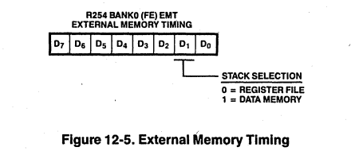
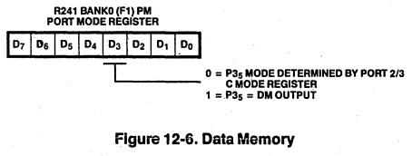
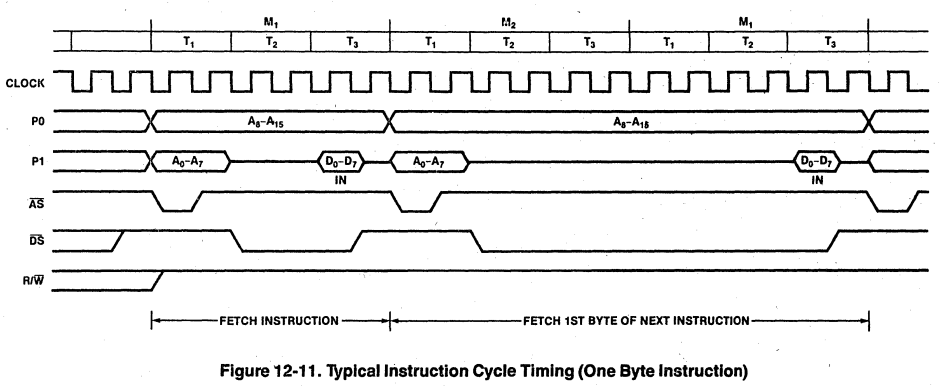

# Super8 Application Note

## GETTING STARTED WITH THE ZILOG SUPER8

### August, 1987

### Charles M. Link, II

Any time an engineer switches to a new processor, he  usually begins the time consuming process of learning  the quirks of the new part. This article is the first of a series of articles written to speed that transition time from any other processor to the Zilog Super8.  

Getting started is the most difficult part of switching to a strange new processor and development tools. Weeks  can be spent just getting the first lines of initialization code written and successfully assembled. Testing the code becomes another problem. The soft ,re from this article series has been tested and it should be possible to copy most of the software directly to a user's application. All of the software is available in machine readable form as noted at the end of the article.  

This first article demonstrates the proper initialization of the Zilog Super8 microcontroller. It sets up a Z8800  ROMLESS for 64K,bytes of external program memory, although most typical applications probably do not require more than maybe 4K or 8K bytes. Ports 2 and 3, which are bit'mappable as inputs or outputs, are set into the output mode. Port 4, also bit mappable, is set into the input mode. A hardware ,schematic has been included as an example.  

The hardware schematic shown defi~es a simple Super8 implementation that was used to test the code in this series oj articles. This example defines a simple valuation board that contains ,32K bytes of programable EPROM, and up to 32K bytes of RAM. The design contains a simple RS-232 interface that is used in future articles of the series. The entire board, including the RS-232 interface, is powered from 5 volts. The RAM battery option allows the software to be downloaded into the RAM and saved if power fails. Additional logic on the design allows a user to protect the lower half of RAM with a simple jumper change. This prevents the processor from destroying executable code if it goes off into space on a power failure.  

Specifically, the ROMLESS Super8 is used as the core. The Super8 requires a latch to demuHiplex the address from the data bus. A 74LS373 fits nicely here, requiring only an inverter to correct for the address strobe. The 'LS373 with inverter is preferred here rather than a single 'LS374 because the 'LS373 is a transparent latch and will present the address earlier than the 'LS374. JU1 selects the EPROM size, correcting for the /PGM pin on 2764 and 27128 EPROMs. It is necessary to use pull down resistors on the upper 4 bits of the address bus because on reset, the ROMLESS Super8 defines only 12 bits for address; the other 4 are set as inputs. Since LS-TIL evices require more current to pull down the inputs, this pull down trick will only work for MOS and CMOS inputs, hence the requirement for the logic chips in this design to be HCT type devices.  

The remaining logic is required to select the EPROM or  RAM. JU2 selects the half-RAM protect mode. JU3 is  set to determine what size ram to protect. This circuit allows the lower half of CMOS battery backed RAM to be  read only, and removes chip select on any writes to that  address space. Of course, that exact circuitry and the  battery is optional, and might be replaced by a power  threshold detector. On the other front, a Maxim MAX  232 provides the RS-232 interface requiring only 5 volts.  

To make the software initialization more interesting, a  few other typical initialization tasks are demonstrated.  The entire block of registers (user ram) is cleared to  zero, and one of the counter timer units is initialized to  provide a periodic interrupt to form the heart of a real  time clock function.

The program shows the typical pseudo-op usage  demonstrated. This article series uses a cross assembler available from Zilog for either an IBM PC or a  VAX operating under VMS. The program bElgins by  defining the registers used as general purpose storage.  This is done so the user does not have to refer to register  numbers, but may refer to a name equated to the  register.  

The first 32 bytes of every program (beginning at 0000H)  always contain the interrupt vectors for the different sources. Using the Zilog assembler, the .WORD pseudo-op  defines a pair of bytes for each of the 16 sources.  Program execution begins at location 0020H. Since  copyright requirements usually require the notice as  close to the beginning as possible, it becomes necessary  to jump around an ASCII string. The .ASCII pseudo-op  generates the necessary string for this notice. 

The source code describes almost completely, without  further explaination, the entire initialization. Once initialized, the processor loops in a WAIT loop waiting on the  periodic interrupt generated by the counterllimer. . The  counter timer interrupts 60 times per second, and the interrupt bumps ram storage locations representing  seconds, minutes, and hours. Each time a location is  bumped, an external port line is toggled so that those  without emulators can see some activity with an oscIlloscope.  In the next article of this series, we will take the same  basic initialization routine and modify it to support the  serial UART. That article will demonstrate polled serial  communications using the Zilog Super 8.  

One point of notice, is the interrupt service routine for the  timer. One must reset the end of count interrupt bit (the  source of interrupt) before exiting the interrupt service  routine.  

[Editors note: The software for this series is available on  an IBM PC diskette and is included with the Super 8  Emulator package available from Creative Technology  Corporation, 5144 Peachtree Road, Suite 301, Atlanta,  GA 30341. (404) 455-8255. Any Zilog Field Application  engineer should also be able to provide copies of the  software on a user provided diskette.] 

# Super8 Technical Manual

## 12. External Interface

## 12.1 INTRODUCTION 

The 4B-pin Super8 has 40 programmable I/O pins,  aome of which are configurable as an external  memory interface. A description of the pins and  their functions follows (see Figure 12-1).  

## 12.2 PIN DESCRIPTIONS 

AS. Address Strobe (output, active low, 3-state).  AS is pulsed low once at the beginning of each  machine cycle. For external memory accesses, the.  rising edge of ms indicates that addresses, R/W,  and DR signals are valid. Under program control,  AS can be placed in a high impedance state along  with Ports 0 and 1, ITS, R/W, and DR if used.  

DS. Data Strobe (output. active low, 3-state).  DS provides timing for data movement to or from  Port 1 for each external memory transfer. During a write cycle, data out is valid at the . leading edge  of crs; during a read cycle, data in is valid prior  to the trailing edge of DS. DS can be placed in a  high-impedance state along with Ports 0 and 1,  AS, R/W, and DM if used.  

R/W. Read/Write (output, 3-state). R/W determines the direction of data transfer for external memory transactions. R/W is low during write  operations and high during all other operations.  R/W can be placed in a high-impedance state along  with Ports 0 and 1, AS, DS, and DM if used.  

P00-P07, P10-P17, P20-P27, P30-P37, P40-P47. I/O  Port Lines (inputs/outputs. TTL-coapatible).  These I/O lines provide five 8-bit I/O ports that can be configured under program control for I/O or  external memory interfacing. Ports 0 and 1 can be  placed in a high-impedance state under program  control, along with AS, DS, R/W, and DM if used. 

Figure 12-1. Pin Functions and ASSignments 

RESET. Reset (input, active low). RESET is used  to initialize the Super8. When RESET is  deactivated, program execution begins from program  address 0020H RESET is also used to enable the  Super8 test mode.  

XTAl1 , XTAl2. Crystal (oscillator input/output).  XTAL 1 and XTAL2 are used to connect a parallel  resonant crystal or external clock source to the  on-board clock oscillator and buffer.  

## 12.3 CONFIGURING fOR EXTERNAl MEMORY 

Before external memory can be referenced in a  ROM-based part, Ports 0 and 1 must be properly  configured. The minimum bus configuration uses  Port 1 as a multiplexed address/data bus (AD0-AD7)  with access to 256 bytes of external memory. In  this configuration, the eight lower order address  bits (A0-A7) are multiplexed with the eight data  bits (D0-D7). 

Additional address lines can be output on the Port  0 pins, where bit 0 of that port corresponds to  A8, bit 1 to A9 and so on. The pins of Port 0  can be defined as memory address lines or I/O  lines on a bit-by-bit basis, via programming of  the Port 0 Mode register (R240, Bank 0). This  ensures the efficient use of the I/O pins, allowing the Super8 to address various sizes of  external memory using no more pins than necessary. Port 0 pins not configured for address  lines can be used as I/O lines.  Configuring Port 1 for external memory is accomplished by writing the appropriate bits in the  Port Mode register, R241 in Bank 0 (Figure 12-2).  

Configuring Port 0 for external memory is accomplished in a similar manner, using Port 0 Mode  Register, R240 in Bank 0 (Figure 12-3).  

Once Port 1 is configured as an address/data port,  it is no longer usable as a general-purpose I/O  port. Attempting to read Port 1 returns "FFH";  writing has no effect. Similarly, if Port 0 is  configured for address lines AB-A15, it is no  longer usable as a general-purpose I/O port; however, if not all of the bits are defined as  address lines, the remaInIng bits are still  accessible as an I/O port. Reading Port 0 will  return the port data in those positions defined as  I/O. The positions defined as address will return  the value on the external pins which, under normal  loading, will be the address. 

> After setting the modes of Ports 0 and 1 for  external memory, the next three bytes must be  fetched from internal memory.  

An external memory interface may be 3-stated under  program control by setting bit 7 of the System  Mode register, R222 (Figure 12-4).  

When this bit is set to 1, the external memory  interface, including AS, DS, R/W and DM, is 3-stated.  A hardware reset forces this bit to a 0.  The external  memory interface can but should not be tri-stated in  the ROMless parts. 

In Super8 parts with on-Chip ROM, a hardware reset  configures Ports 0 and 1 as input ports and  instruction execution begins at location 0020H,  which is within the on-chip ROM.  

In the ROMless parts, a hardware reset configures  Port 0 pins P00-P04 as address out and pins  P05-P07 as inputs; Port 1 is configured as an  address/data port, allowing access to 8 Kbytes of  memory. If external memory greater than 8 Kbytes is desired, additional address lines must be configured in Port D. Since Port D lines are initially configured as inputs, they will float and their logic state will be unknown until an  initialization routine is executed that configures Port D. This initialization routine must reside within the first 8 Kbytes of executable code and must be physically mapped into memory by  externally forcing the Port D address lines to a known state.  

## 12.4 EXTERNAl STACKS 

The Super8 architecture supports stack operations  in either the register file or in data memory. A  stack's location is determined by setting bit 1 in  the External Memory Timing register, R254. Bank 0  (Figure 12-5).  

The instruction used to change the stack selection bit should not be immediately followed by an instruction that uses the stack, since this will cause indeterminate program flow. Interrupts should be disabled when changing the stack selection bit.  

## 12.5 DATA MEMORY 

The two external memory spaces, data and program, can be addressed as a single memory space or as two separate spaces. If the memory spsces are  separated, program memory and data memory are logically selected by the Data Memory select output (DM) , DM is made available on Port 3, line 5  (P35) by setting bit D3 in the Port Mode regiater  to 1 (Figure 12-6).  

## 12.6 BUS OPERATION 

Typical data transfers between the Super8 and  external memory are illustrated in Figures 12-7  and 12-8. Machine cycles can vary from six to  twelve external clock periods depending on the  operation being performed. The notations used to  describe the basic timing periods of the Super8 are machine cycles (Mn), timing states (Tn), and  clock periods. All timing references are made  with respect to the output signals AS and DS. The  clock is shown for clarity only and does not have  specific timing relationships with other signals;  the clock sigrial shown is the external clock,  which has twice the frequency of the internal CPU  clock. 

### 12.6.1 Address Strobe (AS)

All transactions start with Address Strobe (AS)  being driven low and then raised high by the  Super8. The rising edge of AS indicates that  Read/Write (R/W), Data Memory (DM), and the  addresses output from Ports 0 and 1 are valid.  The addresses output via Port 1 typically need to  be latched during AS, whereas Port 0 address  outputs, if used, remain stable throughout the  machine cycle.  

### 12.6.2 Data Strobe (DS)

The Super8 uses Data Strobe (DS) to time the  actual data transfer. For write operations (R/W = low), a low on DS indicates that valid data is on  the Port 1 ADO-AD7 lines. For read operations  (R/W = high), the address/data bus is placed in a high-impedance state before driving DS low so that  the addressed device can put its data on the bus.  The Super8 samples this data prior to raising DS  high.  

### 12.6.1 External memory Operations 

Whenever the Super8 is configured for external  memory operations, the addresses of all internal program memory references appesr on the external bus. This should have no effect on the external  system since the bus control line DS remains in  its inactive high state. DS becomes active only  during external memory references.  

## 12.7 EXTENDED BUS TINING 

The Super8 can accommodate slow memory access and  cycle times by three different methods that give  the user much flexibility in the types of memory  available.  

### 12.7.1 Software Programmable Wait States 

The Super8 can stretch the Data Strobe (DS) timing  automatically by adding one, two, or three  internal clock periods. This is under program  control and applies only to external memory  cycles. Internal memory cycles still operate at  the maximum rate. The software has independent  control over stretched Data Strobe for external  memory (i.e., the software can set up one timing  for program memory and a different timing for data  memory). Thus, program and data memory may be  made up of different kinds of hardware chips, each  requiring its own timing.  

### 12.7.2 Slow Memory Timing 

Another feature of the Super8 that is useful in  interfacing with slow memories is the Slow Memory  Timing option. When this option is enabled, the  normal external memory timing is slowed by a  factor of two (bus clock = CPU. clock divided by  two). All memory times for set-up, duration,  hold, and access times are essentially doubled.  This feature can also be used with the programmed  automatic wait states described above.  Programmed wait states can still be used to stretch the Data  Strobe time by one, two, or three internal clock  times (not two, four, or six) when Slow Memory Timing is enabled.  

### 12.7.3 Hardware Wait States 

Still another Super8 feature is an optional external WAIT input using port pin P34. The WAIT input  function can be used with either or both of the  above two features. Thus the Data Strobe width will have a minimum value determined by the number  of programmed wait states selected and/or by Slow  Memory Timing. The WAIT input provides the means  to stretch it even farther. The WAIT input is  sampled each internal clock time and, if held low, can stretch the Data Strobe by adding one internal  clock period to the Data Strobe time for an  indefinite period of time.  

All of the extended bus timing features are  programmed by writing the appropriate bits in the  External Memory Timing register (Figure 12-9).  

## 12.8 INSTRUCTION TIMING 

The high throughput of the Super8 is due, in part,  to the use of instruction pipelining, where the  instruction fetch and execution cycles are overlapped. During the execution of the current  instruction, the opcode of the next instruction is  fetched, as illustrated in Figure 12-10.  

Figures 12-11 through 12-14 show typicel instruction cycle timing for instructions fetched from  external memory. All instruction fetch cycles  have the same machine timing regardless of whether  the memory is internal or external except when  external memory timing is extended. In order to  calculate the execution time of a program, the internal clock periods shown in the cycles column  of the instruction formats in the Instruction Set  (Chapter 5) should be added. Pipeline cycles are  transparent to the user and should be ignored.  Each cycle represents two cycles of the crystal or input clock. 

## Glossary

addressing mode: The way in which the location of  an operand is specified. There are seven addressing modes: Register, Indirect Register, Indexed,  Direct Address, Indirect Address, Relative  Address, and Immediate.  

auto-echo code: In this UART mode, the data  coming in on the Receive Data pin is reflected out  on the Transmit Data pin. The receive section  still listens to the receive data input; however,  the data from the transmit section goes nowhere.  

base address: The address used, along with an  index and/or displacement value, to calculate the  effective address of an operand. The base address  is located in "a general-purpose register, the  Program Counter, or the instruction.  

baud-rate generator: The UART has its own on-chip  programmable baud-rate gen~rator that consists of  two 8-bit Time Constant registers that hold the  time constant value, a 16-bit Timer/Counter that  counts down, and a flip-flop at the output  producing a square wave.  

bi-value code: A Super8 counter/timer operating  mode wherein the Time Constant and Capture  registers alternate in loading the counter.  

byte: A data item containing 8 contiguous bits.  A byte is the basic data unit for addressing  memory and peripherals.  

capture: A "capture on external event" feature of  the Super8 that takes a snapshot of the counter  when a certain event occurs.  

data memory: A memory address space that can hold  only data to be read or written, not instruction code; data memory is always external to the  Super8.  

Deskew Counter: A 4-bit counter in each handshaking channel that is used to count processor  clocks between the time that valid data is available at the port and the handshake signal indicates that data is available.  

Direct Address (DA) addressing mode: In this  mode, the effective address is contained in the  instruction. 

Direct Memory Access (DMA): An on-chip channel  that provides high-speed transfers of data directly between memory and peripheral devices.  

exception: A condition or event that alters the  usual flow of instruction processing. The Super8  CPU supports two types of exception: reset and  interrupts.  

extended bus timing: The Super8 has the capability of stretching the Data Strobe timing by 1, 2,  or 3 internal clock periods during external memory  accesses. The software can set up one timing for  program memory and a different timing for data  memory.  

fast interrupt processing: Fast interrupt  processing completes the interrupt servicing in 6  clock periods instead of the usual 22.  

Flag register: This register is used to supply  the status of the Super8 CPU at any time.  

Flag': A dedicated register that saves the  contents of the Flag register when a fast interrupt occurs.  

general-purpose registers: The 325 registers that can be used as accumulators, address pointers, index registers, data registers, or stack registers.  

handshaking channels: The Super8 has two identical handshaking channels which operate in two  modes--"fully interlocked" or two-wire mode, and  "strobed" or single-wire mode.  

Immediate (IM) addressing mode: In this mode, the  operand is contained in the instruction.  

Indexed (X) addressing mode: In this mode, the  contents of an index register are added to the  contents of a specified working register or working register pair, which holds the index value  desired.  

Indirect Address (IA) addressing mode: In this  mode, the instruction specifies a pair of memory  locations and this selected pair, in turn, contains the actual address of the instruction to be  executed.  

Indirect Register (IR) addressing mode: In this  mode, the contents of the specified register or  register pair is the address of the operand.  

Instruction Pointer: A 16-bit register that acts  as Program Counter for a threaded-code language,  such as Forth, or can be used ,in the fast interrupt processing mode for' special interrupt  handling.  

interrupt: An asynchronous exception generated by  a peripheral device that needs attention. The  interrupt structure of the Super8 contains 27 different interrupt sources, 16 vectors, and 8  levels.  

interrupt level: Interrupt levels provide the top  level of priority assignment and can be changed by  programming the Interrupt Priority register.  

Interrupt Priority register (IPR): This register  assigns 192 different combinations of priority  when more than one interrupt level is pending.  

interrupt source: An interrupt source is anything  that generates an interrupt, internal or external  to the Super8.  

interrupt vector: The vector number is used to  generate the address of a particular, interrupt  servicing routine.  

local loopback mode: In this mode, the data output from the transmit section of the UART is also  routed back to the receive section.  

pipelining: Instruction pipelining is a c~mputer  design technique in which the inst ruction fetch  and execution cycles are overlapped. ,Thus, duri~g  the execution of the current instruction, the  opcode of the next instruction is fetched, resulting in high throughput.  

Program Counter (PC): The 16-bit Program Counter  controls the sequence of instructions in the  currently executing program and is not an addressable register.  

progrlllll memory: A memory address space that can  hold code or data; program memory can be internal  or external to the Super8.  

read access: The type of memory access used by  the CPU for fetching data operands and instructions.  608  

Register (R) addressing mode: In this mode, the  operand value is the contents of the specified  register or register pair.  

register file: One of the three types of address  spaces supported by the Super8 CPU. Register file  address space is an internal register file composed of 325 8-bit wide registers that are logically  div ided into 32 working register groups of eight  registers each.  

Register Pointer (RP): The two register pointers  are system registers that contain t~e base address  of the two active working register groups of the  register file.  

Relative Address (RA) addressing mode: In this  mode, the displacement in the instruction is added  to the contents of the Program Counter to obtain  the effective address.  

reset: A CPU operating state or exception that  results when a reset request is signaled on the  mrr line. A reset initializes the Program  Status registers.  

Slow memory timing: An optional feature of the  Super8 in which normal external memory timing is  'slowed by a factor of two.  

Stack Pointer (SP): A 16-bit register pair indicating the top (lowest address) of the processor  stack and used by the Call instruction and  interrupts to hold the return address.  

systec registers: System registers govern the  operation of the CPU and may be accessed using any  of the instructions that reference the register,  file using the Direct addressing mode.  

Universal Asynchronous Receiver/Transmitter (UART): A full duplex asynchronous channe 1 that  transmits and receives independently with 5 to B  bits per character, options for even or odd  parity, and an optional wake-up feature.  

wake-up feature: A feature of the UART wherein  pattern match logic detects, a pre-sped Hed data  pattern at the receiver; the pattern can include  both the received character and a special wake-up  bit.  

write access: The type of memory access used by 
the CPU for storing data operands.
