# Super8 Application Note

## GETTING STARTED WITH THE ZILOG SUPER8

### August, 1987

### Charles M. Link, II

Any time an engineer switches to a new processor, he  usually begins the time consuming process of learning  the quirks of the new part. This article is the first of a series of articles written to speed that transition time from any other processor to the Zilog Super8.  

エンジニアが新しいプロセッサに乗り換える場合、通常、新しいパーツの癖を学ぶという時間のかかるプロセスが始まります。この記事は、他のプロセッサからZilog Super8への移行時間を短縮するために書かれた一連の記事の最初のものです。 

Getting started is the most difficult part of switching to a strange new processor and development tools. Weeks  can be spent just getting the first lines of initialization code written and successfully assembled. Testing the code becomes another problem. The soft ,re from this article series has been tested and it should be possible to copy most of the software directly to a user's application. All of the software is available in machine readable form as noted at the end of the article.  

新しいプロセッサや開発ツールに乗り換える際、最も難しいのは最初の立ち上げです。初期化コードの最初の行を書いてアセンブルに成功させるだけで数週間を費やすこともあります。コードのテストはまた別の問題になります。この記事シリーズのソフトウエアはテスト済みであり、ほとんどのソフトウエアをユーザのアプリケーションに直接コピーすることが可能なはずです。記事の最後にあるように、すべてのソフトウエアは機械可読形式で入手可能です。 

This first article demonstrates the proper initialization of the Zilog Super8 microcontroller. It sets up a Z8800  ROMLESS for 64K,bytes of external program memory, although most typical applications probably do not require more than maybe 4K or 8K bytes. Ports 2 and 3, which are bit'mappable as inputs or outputs, are set into the output mode. Port 4, also bit mappable, is set into the input mode. A hardware ,schematic has been included as an example.  

この最初の記事では、Zilog Super8マイクロコントローラの適切な初期化を示します。この記事ではZ8800 ROMLESSを64Kバイトの外部プログラムメモリ用にセットアップしますが、一般的なアプリケーションでは4Kバイトや8Kバイト以上は必要ないでしょう。ポート2と3は入力または出力としてビットマッピング可能で、出力モードに設定されます。ポート4もビットマッピング可能で、入力モードに設定されます。ハードウェアの回路図が例として含まれています。 

The hardware schematic shown defines a simple Super8 implementation that was used to test the code in this series oj articles. This example defines a simple valuation board that contains ,32K bytes of programable EPROM, and up to 32K bytes of RAM. The design contains a simple RS-232 interface that is used in future articles of the series. The entire board, including the RS-232 interface, is powered from 5 volts. The RAM battery option allows the software to be downloaded into the RAM and saved if power fails. Additional logic on the design allows a user to protect the lower half of RAM with a simple jumper change. This prevents the processor from destroying executable code if it goes off into space on a power failure.  

このハードウェア回路図は、本連載のコードをテストするために使用した単純な Super8 の実装を定義したものです。この例では、32K バイトのプログラマブル EPROM と最大 32K バイトの RAM を含むシンプルな評価ボードを定義しています。この設計には、今後の連載で使用する簡単なRS-232インターフェースが含まれています。RS-232インターフェースを含むボード全体が5ボルトで駆動します。RAMバッテリ・オプションにより、電源が落ちた場合にソフトウェアをRAMにダウンロードして保存することができます。設計上の追加ロジックにより、ユーザは簡単なジャンパー変更でRAMの下半分を保護できます。これにより、電源障害時にプロセッサが空間に消えても、実行可能なコードが破壊されることはありません。 

Specifically, the ROMLESS Super8 is used as the core. The Super8 requires a latch to demultiplex the address from the data bus. A 74LS373 fits nicely here, requiring only an inverter to correct for the address strobe. The 'LS373 with inverter is preferred here rather than a single 'LS374 because the 'LS373 is a transparent latch and will present the address earlier than the 'LS374. JU1 selects the EPROM size, correcting for the /PGM pin on 2764 and 27128 EPROMs. It is necessary to use pull down resistors on the upper 4 bits of the address bus because on reset, the ROMLESS Super8 defines only 12 bits for address; the other 4 are set as inputs. Since LS-TIL evices require more current to pull down the inputs, this pull down trick will only work for MOS and CMOS inputs, hence the requirement for the logic chips in this design to be HCT type devices.  

具体的には、ROMLESS Super8がコアとして使用されています。Super8は、データバスからアドレスをデマルチプレックスするためのラッチを必要とします。ここには74LS373がうまく適合し、アドレス・ストローブを補正するインバータだけが必要です。LS373はトランスペアレントラッチであり、LS374よりも早くアドレスが表示されるため、ここではLS374ではなくインバータ付きのLS373が推奨されます。JU1はEPROMサイズを選択し、2764および27128 EPROMの/PGMピンを補正します。アドレスバスの上位4ビットにプルダウン抵抗を使用する必要があります。なぜなら、ROMLESS Super8はリセット時に12ビットしかアドレスを定義せず、残りの4ビットは入力として設定されるからです。LS-TTLデバイスは入力をプルダウンするためにより多くの電流を必要とするため、このプルダウンのトリックはMOSおよびCMOSでのみ機能します。それゆえ、この設計でロジックチップとしてHCTタイプのデバイスを使用する必要があります。

The remaining logic is required to select the EPROM or  RAM. JU2 selects the half-RAM protect mode. JU3 is  set to determine what size ram to protect. This circuit allows the lower half of CMOS battery backed RAM to be  read only, and removes chip select on any writes to that  address space. Of course, that exact circuitry and the  battery is optional, and might be replaced by a power  threshold detector. On the other front, a Maxim MAX  232 provides the RS-232 interface requiring only 5 volts.  

残りのロジックは、EPROM または RAM を選択するために必要です。JU2 はハーフ RAM プロテクト・モードを選択します。JU3 は、保護する RAM のサイズを決定します。この回路は、CMOSバッテリーでバックアップされたRAMの下半分を読み取り専用にし、そのアドレス空間への書き込み時にチップセレクトを解除します。もちろん、この回路とバッテリーはオプションであり、パワー・スレッショルド検出器に置き換えることもできます。もう一方の前面では、Maxim MAX 232が5ボルトだけでRS-232インターフェースを提供します。 

To make the software initialization more interesting, a  few other typical initialization tasks are demonstrated.  The entire block of registers (user ram) is cleared to  zero, and one of the counter timer units is initialized to  provide a periodic interrupt to form the heart of a real  time clock function.

ソフトウェアの初期化をより面白くするために、他のいくつかの典型的な初期化タスクが示されています。 レジスタ・ブロック全体(ユーザRAM)がゼロ・クリアされ、カウンタ・タイマ・ユニットの1つが、リアルタイム・クロック機能の心臓部を形成する周期的割り込みを提供するために初期化されます。

The program shows the typical pseudo-op usage  demonstrated. This article series uses a cross assembler available from Zilog for either an IBM PC or a  VAX operating under VMS. The program begins by  defining the registers used as general purpose storage.  This is done so the user does not have to refer to register  numbers, but may refer to a name equated to the  register.  

このプログラムでは、典型的な擬似命令の使い方が示されています。この記事シリーズでは、IBM PCまたはVMSで動作するVAX用にZilog社から入手可能なクロスアセンブラを使用しています。このプログラムの最初で、使用するレジスタを汎用ストレージとして定義しています。 これは、ユーザがレジスタ番号を参照する必要がなく、レジスタに等しい名前を参照できるようにするためです。 

The first 32 bytes of every program (beginning at 0000H)  always contain the interrupt vectors for the different sources. Using the Zilog assembler, the .WORD pseudo-op  defines a pair of bytes for each of the 16 sources.  Program execution begins at location 0020H. Since  copyright requirements usually require the notice as  close to the beginning as possible, it becomes necessary  to jump around an ASCII string. The .ASCII pseudo-op  generates the necessary string for this notice. 

すべてのプログラムの最初の32バイト(0000Hから始まる)には、異なるソースの割り込みベクタから開始します。Zilogアセンブラを使用する場合、.WORD疑似オペランドは16この割り込みソースに対してバイトのペアを定義します。 プログラムの実行は0020Hから始まります。通常、著作権の要件では、できるだけ冒頭に近い場所で著作権を通知する必要があるため、ASCII文字列を跳び越す必要があります。.ASCII疑似命令は、著作権通知に必要な文字列を生成します。

The source code describes almost completely, without  further explaination, the entire initialization. Once initialized, the processor loops in a WAIT loop waiting on the  periodic interrupt generated by the counterllimer. . The  counter timer interrupts 60 times per second, and the interrupt bumps ram storage locations representing  seconds, minutes, and hours. Each time a location is  bumped, an external port line is toggled so that those  without emulators can see some activity with an oscIlloscope.  In the next article of this series, we will take the same  basic initialization routine and modify it to support the  serial UART. That article will demonstrate polled serial  communications using the Zilog Super 8.  

ソース・コードは、初期化全体を、これ以上の説明なしに、ほぼ完全に記述しています。初期化されると、プロセッサはWAITループでループし、カウンタライマによって生成される定期的な割り込みを待ちます。カウンタ・タイマは1秒間に60回の割り込みを行い、割り込みは秒、分、時間を表すラムの記憶場所をバンプします。位置がバンプされるたびに、外部ポート・ラインがトグルされるので、エミュレータを持たない人でもオシロスコープで何か動作している様子を見ることができます。 このシリーズの次の記事では、同じ基本的な初期化ルーチンを、シリアルUARTをサポートするように変更します。その記事では、Zilog Super 8を使用したポーリング・シリアル通信をデモします。 

One point of notice, is the interrupt service routine for the  timer. One must reset the end of count interrupt bit (the  source of interrupt) before exiting the interrupt service  routine.  

注意点として、タイマの割り込みサービスルーチンがあります。割り込みサービスルーチンを終了する前に、カウント終了割り込みビット(割り込みの発生源)をリセットする必要があります。 

[Editors note: The software for this series is available on  an IBM PC diskette and is included with the Super 8  Emulator package available from Creative Technology  Corporation, 5144 Peachtree Road, Suite 301, Atlanta,  GA 30341. (404) 455-8255. Any Zilog Field Application  engineer should also be able to provide copies of the  software on a user provided diskette.] 

[編集者注: このシリーズのソフトウェアはIBM PCのディスケットで入手可能で、Creative Technology Corporation, 5144 Peachtree Road, Suite 301, Atlanta, GA 30341から入手可能なSuper 8 Emulatorパッケージに含まれています。(404) 455-8255. Zilog Field Applicationのエンジニアであれば、ユーザ提供のディスケットでソフトウェアのコピーを提供できるはずです。］ 

# Super8 Technical Manual

## 12. External Interface

## 12.1 INTRODUCTION 

The 4B-pin Super8 has 40 programmable I/O pins,  aome of which are configurable as an external  memory interface. A description of the pins and  their functions follows (see Figure 12-1).  

4B ピンの Super8 には 40 本のプログラム可能な I/O ピンがあり、そのうちのいくつかは外部メモリ・インターフェースとして設定可能です。ピンとその機能の説明は以下の通りです(図 12-1 参照)。 

## 12.2 PIN DESCRIPTIONS 

AS. Address Strobe (output, active low, 3-state).  AS is pulsed low once at the beginning of each  machine cycle. For external memory accesses, the.  rising edge of ms indicates that addresses, R/W,  and DR signals are valid. Under program control,  AS can be placed in a high impedance state along  with Ports 0 and 1, ITS, R/W, and DR if used.  

AS. アドレスストローブ(出力、アクティブLow、3ステート)。 ASは、各マシン・サイクルの開始時に1回Lowにパルスされます。外部メモリ・アクセスの場合、msの立ち上がりエッジは、アドレス、R/W、DR信号が有効であることを示します。プログラム制御の下で、ASはポート0と1、ITS、R/W、DR(使用されている場合)と共にハイ・インピーダンス状態にすることができます。 

DS. Data Strobe (output. active low, 3-state).  DS provides timing for data movement to or from  Port 1 for each external memory transfer. During a write cycle, data out is valid at the . leading edge  of crs; during a read cycle, data in is valid prior  to the trailing edge of DS. DS can be placed in a  high-impedance state along with Ports 0 and 1,  AS, R/W, and DM if used.  

DS. データ・ストローブ(出力。アクティブ・ロー、3ステート)。 DSは、外部メモリ転送ごとに、ポート1への、またはポート1からのデータ移動のタイミングを提供します。書き込みサイクルでは、データ・アウトはcrsの前縁で有効であり、読み出しサイクルでは、データ・インはDSの後縁より前に有効です。DSは、ポート0と1、AS、R/W、DMとともにハイインピーダンス状態にすることができます。 

R/W. Read/Write (output, 3-state). R/W determines the direction of data transfer for external memory transactions. R/W is low during write  operations and high during all other operations.  R/W can be placed in a high-impedance state along  with Ports 0 and 1, AS, DS, and DM if used.  

R/W. リード／ライト(出力、3ステート)。R/W は、外部メモリ・トランザクションのデータ転送方向を決定します。R/Wは、書き込み動作中はLowで、それ以外の動作中はHighです。 R/W は、ポート 0、1、AS、DS、DM とともにハイインピーダンス状態にすることができます。 

P00-P07, P10-P17, P20-P27, P30-P37, P40-P47. I/O  Port Lines (inputs/outputs. TTL-coapatible).  These I/O lines provide five 8-bit I/O ports that can be configured under program control for I/O or  external memory interfacing. Ports 0 and 1 can be  placed in a high-impedance state under program  control, along with AS, DS, R/W, and DM if used. 

P00-P07、P10-P17、P20-P27、P30-P37、P40-P47。I/Oポート・ライン(入力/出力、TTLコンパチブル)。 これらのI/Oラインは5つの8ビットI/Oポートを提供し、I/Oまたは外部メモリ・インターフェイス用にプログラム制御で設定できます。ポート0と1は、AS、DS、R/W、DM(使用する場合)と共に、プログラム制御下でハイインピーダンス状態にすることができます。

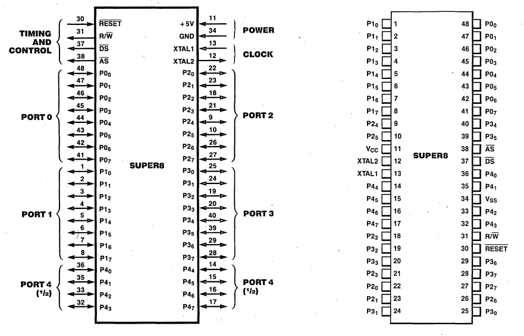

Figure 12-1. Pin Functions and ASSignments 

RESET. Reset (input, active low). RESET is used  to initialize the Super8. When RESET is  deactivated, program execution begins from program  address 0020H RESET is also used to enable the  Super8 test mode.  

リセット。リセット(入力、アクティブLow)。RESET は Super8 を初期化するために使用されます。RESET が解除されると、プログラムの実行はプログラム・アドレス 0020H から開始されます。RESET は Super8 テスト・モードを有効にするためにも使用されます。 

XTAl1 , XTAl2. Crystal (oscillator input/output).  XTAL 1 and XTAL2 are used to connect a parallel  resonant crystal or external clock source to the  on-board clock oscillator and buffer.  

XTAl1 , XTAl2. 水晶振動子(発振器入出力)。 XTAL1 と XTAL2 は、並列共振水晶振動子または外部クロック源をオンボードのクロック発振器とバッファーに 接続するために使用します。 

## 12.3 CONFIGURING fOR EXTERNAl MEMORY 

Before external memory can be referenced in a  ROM-based part, Ports 0 and 1 must be properly  configured. The minimum bus configuration uses  Port 1 as a multiplexed address/data bus (AD0-AD7)  with access to 256 bytes of external memory. In  this configuration, the eight lower order address  bits (A0-A7) are multiplexed with the eight data  bits (D0-D7). 

ROM ベースの部品で外部メモリを参照する前に、ポート 0 と 1 を適切に設定する必要があります。最小のバス構成では、ポート 1 を多重化アドレス/データ・バス(AD0-AD7) として使用し、256 バイトの外部メモリにアクセスします。この構成では、8 つの下位アドレス・ビット(A0-A7)が 8 つのデータ・ビット(D0-D7)と多重化されます。

Additional address lines can be output on the Port  0 pins, where bit 0 of that port corresponds to  A8, bit 1 to A9 and so on. The pins of Port 0  can be defined as memory address lines or I/O  lines on a bit-by-bit basis, via programming of  the Port 0 Mode register (R240, Bank 0). This  ensures the efficient use of the I/O pins, allowing the Super8 to address various sizes of  external memory using no more pins than necessary. Port 0 pins not configured for address  lines can be used as I/O lines.  Configuring Port 1 for external memory is accomplished by writing the appropriate bits in the  Port Mode register, R241 in Bank 0 (Figure 12-2).  

追加アドレス・ラインは、ポート 0 ピンに出力することができ、ポート 0 のビット 0 は A8、ビット 1 は A9 などに対応します。ポート0のピンは、ポート0モード・レジスタ(R240、バンク0)のプログラミングにより、ビットごとにメモリ・アドレス・ラインまたはI/Oラインとして定義できます。これにより、I/Oピンの効率的な使用が保証され、Super8は必要以上のピンを使用することなく、さまざまなサイズの外部メモリをアドレス指定することができます。アドレス・ライン用に設定されていないポート0ピンは、I/Oラインとして使用できます。 外部メモリ用にポート 1 を設定するには、バンク 0 の R241 ポート・モード・レジスタに適切なビットを書き込むことで 実現できる(図 12-2)。 

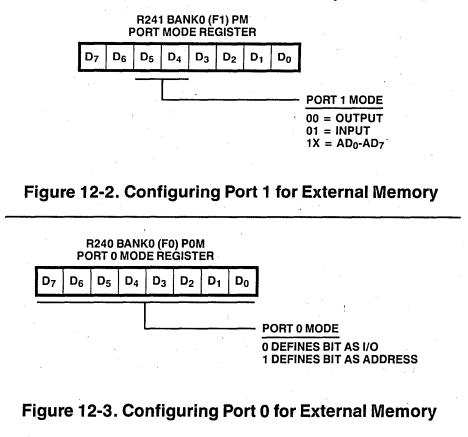

Configuring Port 0 for external memory is accomplished in a similar manner, using Port 0 Mode  Register, R240 in Bank 0 (Figure 12-3).  

ポート 0 を外部メモリ用に設定する場合も同様で、バンク 0 の R240 ポート 0 モード・レジスタを使用する(図 12-3)。 

Once Port 1 is configured as an address/data port,  it is no longer usable as a general-purpose I/O  port. Attempting to read Port 1 returns "FFH";  writing has no effect. Similarly, if Port 0 is  configured for address lines AB-A15, it is no  longer usable as a general-purpose I/O port; however, if not all of the bits are defined as  address lines, the remaInIng bits are still  accessible as an I/O port. Reading Port 0 will  return the port data in those positions defined as  I/O. The positions defined as address will return  the value on the external pins which, under normal  loading, will be the address. 

ポート1がアドレス/データ・ポートとして設定されると、汎用I/Oポートとしては使用できなくなります。ポート1を読み出そうとすると "FFH "が返され、書き込んでも効果はありません。同様に、ポート0がアドレス・ラインAB-A15に設定されている場合、汎用I/Oポートとしては使用できなくなります。しかし、すべてのビットがアドレス・ラインとして定義されていない場合、残りのビットはまだI/Oポートとしてアクセス可能です。ポート0を読み出すと、I/Oとして定義された位置のポート・データが返されます。アドレスとして定義された位置は、通常のロードではアドレスとなる外部ピンの値を返します。

> After setting the modes of Ports 0 and 1 for  external memory, the next three bytes must be  fetched from internal memory.  

> ポート0と1のモードを外部メモリ用に設定した後、次の3バイトを内部メモリからフェッチしなければなりません。 

An external memory interface may be 3-stated under  program control by setting bit 7 of the System  Mode register, R222 (Figure 12-4).  

外部メモリ・インターフェースは、システム・モード・レジスタの R222 (図 12-4)のビット 7 を設定することで、プログラム制御下で 3 ステート化することができます。 

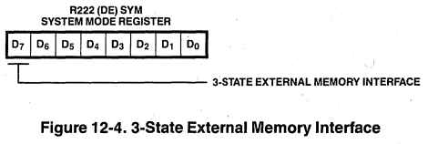

When this bit is set to 1, the external memory  interface, including AS, DS, R/W and DM, is 3-stated.  A hardware reset forces this bit to a 0.  The external  memory interface can but should not be tri-stated in  the ROMless parts. 

このビットが 1 にセットされると、AS、DS、R/W、DM を含む外部メモリ・インターフェースは 3 ス テートとなります。 ハードウェア・リセットにより、このビットは強制的に 0 になります。ROM レス部品では、外部メモリ・インター フェースは 3 ステート化できますが、すべきではありません。

In Super8 parts with on-Chip ROM, a hardware reset  configures Ports 0 and 1 as input ports and  instruction execution begins at location 0020H,  which is within the on-chip ROM.  

オンチップ ROM を搭載した Super8 では、ハードウェア・リセットによりポート 0 と 1 が入力ポートに設定され、命令実行はオンチップ ROM 内の位置 0020H から開始されます。 

In the ROMless parts, a hardware reset configures  Port 0 pins P00-P04 as address out and pins  P05-P07 as inputs; Port 1 is configured as an  address/data port, allowing access to 8 Kbytes of  memory. If external memory greater than 8 Kbytes is desired, additional address lines must be configured in Port D. Since Port D lines are initially configured as inputs, they will float and their logic state will be unknown until an  initialization routine is executed that configures Port D. This initialization routine must reside within the first 8 Kbytes of executable code and must be physically mapped into memory by  externally forcing the Port D address lines to a known state.  

ROMレス品では、ハードウェア・リセットにより、ポート0はP00～P04ピンがアドレス出力、P05～P07ピンが入力に設定され、ポート1はアドレス/データ・ポートに設定され、8Kバイトのメモリにアクセスできるようになります。ポートDラインは初期状態では入力として構成されているため、ポートDを構成する初期化ルーチンが実行されるまではフロートし、その論理状態は不明です。この初期化ルーチンは最初の8Kバイトの実行コード内に存在する必要があり、外部からポートDアドレス・ラインを既知の状態に強制することにより、物理的にメモリにマッピングする必要があります。 

## 12.4 EXTERNAl STACKS 

The Super8 architecture supports stack operations  in either the register file or in data memory. A  stack's location is determined by setting bit 1 in  the External Memory Timing register, R254. Bank 0  (Figure 12-5).  

Super8 アーキテクチャは、レジスタ・ファイルまたはデータ・メモリ内のスタック操作をサポー トします。スタックの位置は、外部メモリ・タイミング・レジスタ(R254)のビット 1 の設定により決定されます。バンク 0(図 12-5)。 

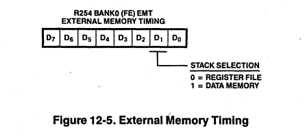

The instruction used to change the stack selection bit should not be immediately followed by an instruction that uses the stack, since this will cause indeterminate program flow. Interrupts should be disabled when changing the stack selection bit.  

スタック選択ビットを変更する命令は、スタックを使用する命令の直後に続けるべきではありません。スタック選択ビットを変更するときは、割り込みを無効にしてください。 

## 12.5 DATA MEMORY 

The two external memory spaces, data and program, can be addressed as a single memory space or as two separate spaces. If the memory spsces are  separated, program memory and data memory are logically selected by the Data Memory select output (DM) , DM is made available on Port 3, line 5  (P35) by setting bit D3 in the Port Mode regiater  to 1 (Figure 12-6).  

データとプログラムの2つの外部メモリ空間は、1つのメモリ空間としてアドレス指定することも、 2つの別々の空間としてアドレス指定することもできます。メモリ空間が分離されている場合、プログラム・メモリとデータ・メモリは、データ・メモリ・セレクト出力(DM)により論理的に選択されます。DMは、ポート・モード・レジスタのビットD3を1に設定することにより、ポート3、ライン5(P35)で利用可能 になります(図12-6)。 

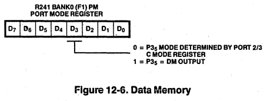

## 12.6 BUS OPERATION 

Typical data transfers between the Super8 and  external memory are illustrated in Figures 12-7  and 12-8. Machine cycles can vary from six to  twelve external clock periods depending on the  operation being performed. The notations used to  describe the basic timing periods of the Super8 are machine cycles (Mn), timing states (Tn), and  clock periods. All timing references are made  with respect to the output signals AS and DS. The  clock is shown for clarity only and does not have  specific timing relationships with other signals;  the clock sigrial shown is the external clock,  which has twice the frequency of the internal CPU  clock. 

Super8 と外部メモリ間の典型的なデータ転送を図 12-7 と 12-8 に示します。マシン・サイクルは、実行される動作によって 6～12 の外部クロック周期の値を取ります。Super8 の基本的なタイミング周期を説明するために使用される表記は、マシンサイクル(Mn)、タイミング ステート(Tn)、クロック周期です。すべてのタイミング参照は出力信号 AS と DS を基準に行われます。クロックは分かりやすくするために表示されているもので、他の信号との特定のタイミング関係はありません。表示されているクロック信号は外部クロックで、内部CPUクロックの2倍の周波数を持っています。

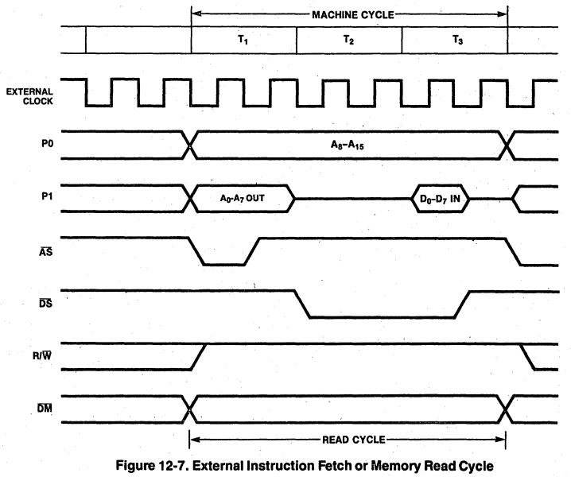

### 12.6.1 Address Strobe (AS)

All transactions start with Address Strobe (AS)  being driven low and then raised high by the  Super8. The rising edge of AS indicates that  Read/Write (R/W), Data Memory (DM), and the  addresses output from Ports 0 and 1 are valid.  The addresses output via Port 1 typically need to  be latched during AS, whereas Port 0 address  outputs, if used, remain stable throughout the  machine cycle.  

すべてのトランザクションは、アドレス・ストローブ(AS)がロー・レベルに駆動され、その後 Super8 によってハイ・レベルに立ち上げられることから始まります。AS の立ち上がりエッジは、リード/ライト(R/W)、データ・メモリ(DM)、ポート 0 と 1 から出力されるアドレスが有効であることを示します。 ポート1から出力されるアドレスは通常AS中にラッチされる必要がありますが、ポート0のアドレス出力は、使用される場合、マシンサイクルを通して安定したままです。 

### 12.6.2 Data Strobe (DS)

The Super8 uses Data Strobe (DS) to time the  actual data transfer. For write operations (R/W = low), a low on DS indicates that valid data is on  the Port 1 ADO-AD7 lines. For read operations  (R/W = high), the address/data bus is placed in a high-impedance state before driving DS low so that  the addressed device can put its data on the bus.  The Super8 samples this data prior to raising DS  high.  

Super8 はデータ・ストローブ(DS)を使用して実際のデータ転送のタイミングを取ります。書き込み動作(R/W = Low)の場合、DS の Low は有効なデータがポート 1 の ADO-AD7 ライン上にあることを示します。読み出し動作(R/W = HIGH)の場合、アドレス/データ・バスは DS をロー・ドライブする前にハイ・インピーダンス状態になり、アドレス指定されたデバイスがそのデータをバス上に置くことができます。 Super8 は DS をハイにする前にこのデータをサンプリングします。 

### 12.6.1 External memory Operations 

Whenever the Super8 is configured for external  memory operations, the addresses of all internal program memory references appesr on the external bus. This should have no effect on the external  system since the bus control line DS remains in  its inactive high state. DS becomes active only  during external memory references.  

Super8 が外部メモリ操作用に設定されているときはいつでも、すべての内部プログラム・ メモリ参照のアドレスが外部バス上に現れます。バス制御線DSは非アクティブのHigh状態のままであるため、外部システムには何の影響もないはずです。DSがアクティブになるのは、外部メモリ参照時のみです。 

## 12.7 EXTENDED BUS TINING 

The Super8 can accommodate slow memory access and  cycle times by three different methods that give  the user much flexibility in the types of memory  available.  

Super8は、3つの異なる方法により、遅いメモリアクセスとサイクルタイムに対応することができ、利用可能なメモリの種類に柔軟性を持たせることができます。 

### 12.7.1 Software Programmable Wait States 

The Super8 can stretch the Data Strobe (DS) timing  automatically by adding one, two, or three  internal clock periods. This is under program  control and applies only to external memory  cycles. Internal memory cycles still operate at  the maximum rate. The software has independent  control over stretched Data Strobe for external  memory (i.e., the software can set up one timing  for program memory and a different timing for data  memory). Thus, program and data memory may be  made up of different kinds of hardware chips, each  requiring its own timing.  

Super8 は、1、2、または 3 つの内部クロック周期を追加することで、データストローブ(DS) タイミングを自動的に伸ばすことができます。これはプログラム制御下にあり、外部メモリサイクルにのみ適用されます。内部メモリ・サイクルは最大レートで動作します。ソフトウェアは、外部メモリ用に伸張されたデータ・ストローブに対して独立した制御が可能である(すなわち、ソフトウェアがプログラム・メモリ用に1つのタイミングを設定し、データ・メモリ用に異なるタイミングを設定することができる)。したがって、プログラム・メモリとデータ・メモリは異なる種類のハード ウェア・チップで構成することができ、それぞれが独自のタイミングを必要とします。 

### 12.7.2 Slow Memory Timing 

Another feature of the Super8 that is useful in  interfacing with slow memories is the Slow Memory  Timing option. When this option is enabled, the  normal external memory timing is slowed by a  factor of two (bus clock = CPU. clock divided by  two). All memory times for set-up, duration,  hold, and access times are essentially doubled.  This feature can also be used with the programmed  automatic wait states described above.  Programmed wait states can still be used to stretch the Data  Strobe time by one, two, or three internal clock  times (not two, four, or six) when Slow Memory Timing is enabled.  

低速メモリとのインターフェイスに便利な Super8 のもう一つの機能は、Slow Memory Timing オプションです。このオプションを有効にすると、通常の外部メモリ・タイミングが 2 倍遅くなります(バス・クロック = CPU.クロック÷2)。セットアップ時間、持続時間、ホールド時間、およびアクセス時間のすべてのメモリ時間は、実質的に2倍になります。 この機能は、前述のプログラムされた自動ウェイト・ステートと併用することもできます。 プログラムされたウェイト・ステートは、Slow Memory Timingが有効になっているときでも、データ・ストローブ時間を内部クロックの1、2、3倍(2、4、6倍ではない)に引き延ばすために使用することができます。 

### 12.7.3 Hardware Wait States 

Still another Super8 feature is an optional external WAIT input using port pin P34. The WAIT input  function can be used with either or both of the  above two features. Thus the Data Strobe width will have a minimum value determined by the number  of programmed wait states selected and/or by Slow  Memory Timing. The WAIT input provides the means  to stretch it even farther. The WAIT input is  sampled each internal clock time and, if held low, can stretch the Data Strobe by adding one internal  clock period to the Data Strobe time for an  indefinite period of time.  

さらにもう一つの Super8 の機能として、ポートピン P34 を使った外部 WAIT 入力がオプションで用意されています。WAIT入力機能は、上記2つの機能のどちらか、または両方と一緒に使用することができます。従って、データストローブ幅は、選択されたプログラムされたウェイトステートの数および/またはスローメモリタイミングによって決定される最小値を持つことになります。WAIT入力は、それをさらに伸ばす手段を提供します。WAIT入力は内部クロック時間毎にサンプリングされ、Lowのままであれば、データ・ストローブ時間に1内部クロック期間を追加することにより、データ・ストローブ幅を不定時間拡張することができます。 

All of the extended bus timing features are  programmed by writing the appropriate bits in the  External Memory Timing register (Figure 12-9).  

すべての拡張バス・タイミング機能は、外部メモリ・タイミング・レジスタ(図 12-9)の適切なビットを書き込むことでプログラムされます。 

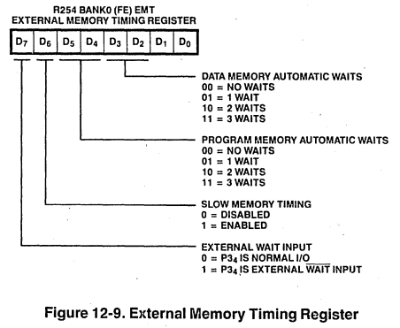

## 12.8 INSTRUCTION TIMING 

The high throughput of the Super8 is due, in part,  to the use of instruction pipelining, where the  instruction fetch and execution cycles are overlapped. During the execution of the current  instruction, the opcode of the next instruction is  fetched, as illustrated in Figure 12-10.  

Super8 の高いスループットは、命令フェッチと実行サイクルをオーバーラップさせる命令パイプラインの使用によるところが大きい。図 12-10 に示すように、現在の命令の実行中に、次の命令のオペコードがフェッチされます。 

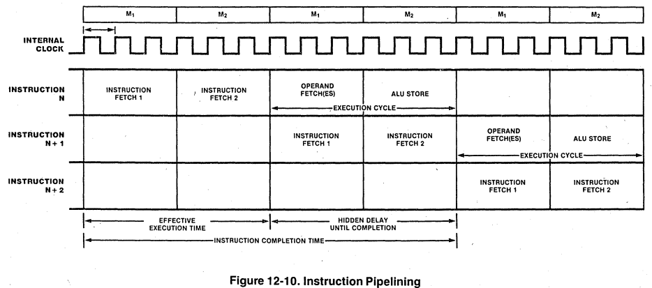

Figures 12-11 through 12-14 show typicel instruction cycle timing for instructions fetched from  external memory. All instruction fetch cycles  have the same machine timing regardless of whether  the memory is internal or external except when  external memory timing is extended. In order to  calculate the execution time of a program, the internal clock periods shown in the cycles column  of the instruction formats in the Instruction Set  (Chapter 5) should be added. Pipeline cycles are  transparent to the user and should be ignored.  Each cycle represents two cycles of the crystal or input clock. 

図12-11～12-14は、外部メモリからフェッチされる命令の典型的な命令サイクル・タイミングを示しています。すべての命令フェッチ・サイクルは、外部メモリ・タイミングが拡張されている場合を除き、メモリが内部か外部かに関係なく同じマシン・タイミングになります。プログラムの実行時間を計算するには、命令セット(第5章)の命令フォーマットのサイクル欄に示されている内部クロック周期を加算する必要があります。パイプライン・サイクルはユーザにとって透過的であり、無視されるべきです。 各サイクルは水晶振動子または入力クロックの2サイクルに相当します。

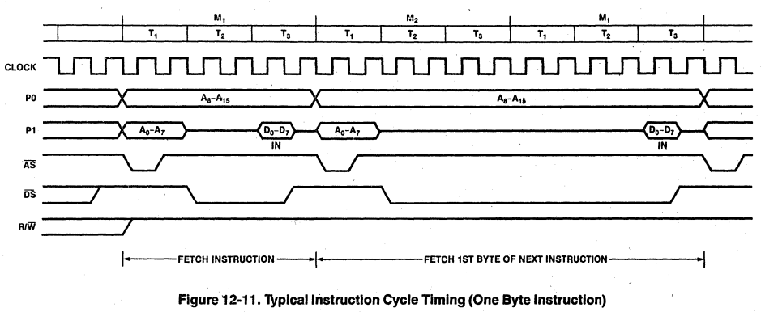

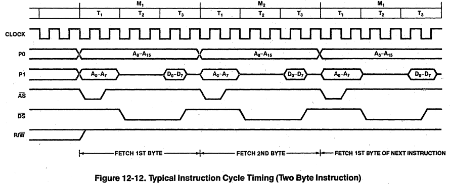

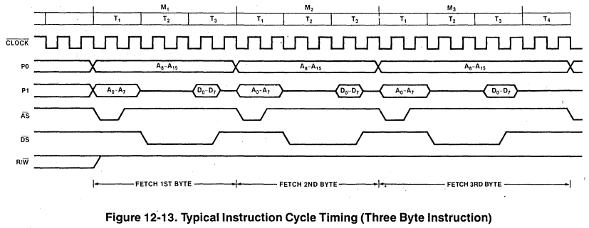

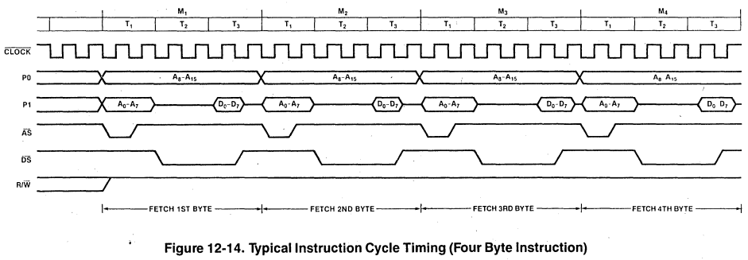

## Glossary

addressing mode: The way in which the location of  an operand is specified. There are seven addressing modes: Register, Indirect Register, Indexed,  Direct Address, Indirect Address, Relative  Address, and Immediate.  

auto-echo code: In this UART mode, the data  coming in on the Receive Data pin is reflected out  on the Transmit Data pin. The receive section  still listens to the receive data input; however,  the data from the transmit section goes nowhere.  

base address: The address used, along with an  index and/or displacement value, to calculate the  effective address of an operand. The base address  is located in "a general-purpose register, the  Program Counter, or the instruction.  

baud-rate generator: The UART has its own on-chip  programmable baud-rate gen~rator that consists of  two 8-bit Time Constant registers that hold the  time constant value, a 16-bit Timer/Counter that  counts down, and a flip-flop at the output  producing a square wave.  

auto-echo code (オート・エコー・コード):  このUARTモードでは、受信データ・ピンで入力されたデータは送信データ・ピンに反映されます。受信部はまだ受信データ入力を聞いていますが、送信部からのデータはどこにも行きません。 

ベースアドレス:  オペランドの実効アドレスを計算するために、インデックスまたは変位値とともに使用されるアドレス。ベース・アドレスは、汎用レジスタ、プログラム・カウンタ、または命令に配置されます。 

ボーレート・ジェネレーター:  UARTは、時定数値を保持する2つの8ビット時定数レジスタ、カウントダウンする16ビット・タイマ/カウンタ、および矩形波を生成する出力のフリップフロップで構成される、独自のオンチップ・プログラマブル・ボーレート・ジェネレータを持っています。 

bi-value code: A Super8 counter/timer operating  mode wherein the Time Constant and Capture  registers alternate in loading the counter.  

byte: A data item containing 8 contiguous bits.  A byte is the basic data unit for addressing  memory and peripherals.  

capture: A "capture on external event" feature of  the Super8 that takes a snapshot of the counter  when a certain event occurs.  

data memory: A memory address space that can hold  only data to be read or written, not instruction code; data memory is always external to the  Super8.  

Deskew Counter: A 4-bit counter in each handshaking channel that is used to count processor  clocks between the time that valid data is available at the port and the handshake signal indicates that data is available.  

バイ・バリュー・コード:  Super8カウンタ/タイマの動作モードで、時定数レジスタとキャプチャレジスタが交互にカウンタをロードします。 

byte(バイト):  連続した8ビットを含むデータ。 バイトはメモリやペリフェラルをアドレス指定するための基本的なデータ単位。 

capture (キャプチャ):  Super8の "capture on external event "機能で、特定のイベントが発生するとカウンタのスナップショットを取ります。 

データ・メモリ:  命令コードではなく、読み書きするデータのみを保持できるメモリアドレス空間。データメモリは常にSuper8の外部にあります。 

Deskew Counter (デスキュー・カウンタ):  各ハンドシェイク・チャネルにある4ビットのカウンタで、ポートで有効なデータが利用可能になってからハンドシェイク信号がデータが利用可能であることを示すまでのプロセッサ・クロックをカウントするために使用されます。 

Direct Address (DA) addressing mode: In this  mode, the effective address is contained in the  instruction. 

Direct Memory Access (DMA): An on-chip channel  that provides high-speed transfers of data directly between memory and peripheral devices.  

exception: A condition or event that alters the  usual flow of instruction processing. The Super8  CPU supports two types of exception: reset and  interrupts.  

extended bus timing: The Super8 has the capability of stretching the Data Strobe timing by 1, 2,  or 3 internal clock periods during external memory  accesses. The software can set up one timing for  program memory and a different timing for data  memory.  

fast interrupt processing: Fast interrupt  processing completes the interrupt servicing in 6  clock periods instead of the usual 22.  

Flag register: This register is used to supply  the status of the Super8 CPU at any time.  

ダイレクト・アドレス(DA)アドレッシング・モード:  このモードでは、実効アドレスが命令に含まれます。

ダイレクト・メモリ・アクセス(DMA):  メモリと周辺機器の間で直接データを高速転送するオンチップ・チャネル。 

exception (例外):  通常の命令処理の流れを変える条件や事象。Super8 CPUは、リセットと割り込みの2種類の例外をサポートしています。 

extended bus timing(エクステンデッド・バス・タイミング):  Super8は、外部メモリ・アクセス時にデータ・ストローブ・タイミングを内部クロックで1、2、または3周期伸ばすことができます。ソフトウェアにより、プログラム・メモリ用に1つのタイミングを設定し、データ・メモリ用に異なるタイミングを設定することができます。 

高速割り込み処理:  高速割り込み処理は、通常の22クロック周期ではなく、6クロック周期で割り込み処理を完了します。 

フラグ・レジスタ:  このレジスタは、Super8 CPUのステータスを常時供給するために使用されます。 

Flag': A dedicated register that saves the  contents of the Flag register when a fast interrupt occurs.  

general-purpose registers: The 325 registers that can be used as accumulators, address pointers, index registers, data registers, or stack registers.  

handshaking channels: The Super8 has two identical handshaking channels which operate in two  modes--"fully interlocked" or two-wire mode, and  "strobed" or single-wire mode.  

Immediate (IM) addressing mode: In this mode, the  operand is contained in the instruction.  

Indexed (X) addressing mode: In this mode, the  contents of an index register are added to the  contents of a specified working register or working register pair, which holds the index value  desired.  

Indirect Address (IA) addressing mode: In this  mode, the instruction specifies a pair of memory  locations and this selected pair, in turn, contains the actual address of the instruction to be  executed.  

Flag」:  高速割り込み発生時にFlagレジスタの内容を保存する専用レジスタ。 

汎用レジスタ:  アキュムレータ、アドレス・ポインタ、インデックス・レジスタ、データ・レジスタ、スタック・レジスタとして使用できる325本のレジスタ。 

handshaking channels(ハンドシェイク・チャンネル):  Super8には2つの同じハンドシェイク・チャンネルがあり、「完全インターロック」または2線式モードと「ストローブ」または1線式モードの2つのモードで動作します。 

イミディエイト(IM)アドレッシング・モード:  このモードでは、オペランドは命令に含まれます。 

インデックス付き(X)アドレッシング・モード:  このモードでは、インデックスレジスタの内容が、指定された作業レジスタまたは作業レジスタペアの内容に追加されます。 

間接アドレス(IA)アドレッシング・モード:  このモードでは、命令はメモリ位置のペアを指定し、この選択されたペアは、順番に、実行される命令の実際のアドレスを含みます。 

Indirect Register (IR) addressing mode: In this  mode, the contents of the specified register or  register pair is the address of the operand.  

Instruction Pointer: A 16-bit register that acts  as Program Counter for a threaded-code language,  such as Forth, or can be used ,in the fast interrupt processing mode for' special interrupt  handling.  

interrupt: An asynchronous exception generated by  a peripheral device that needs attention. The  interrupt structure of the Super8 contains 27 different interrupt sources, 16 vectors, and 8  levels.  

interrupt level: Interrupt levels provide the top  level of priority assignment and can be changed by  programming the Interrupt Priority register.  

Interrupt Priority register (IPR): This register  assigns 192 different combinations of priority  when more than one interrupt level is pending.  

interrupt source: An interrupt source is anything  that generates an interrupt, internal or external  to the Super8.  

間接レジスタ(IR)アドレッシング・モード:  このモードでは、指定されたレジスタまたはレジスタ・ペアの内容がオペランドのアドレスとなります。 

Instruction Pointer(命令ポインタ):  Forthのようなスレッドコード言語のプログラム・カウンタとして機能する16ビットのレジスタで、高速割り込み処理モードでは特別な割り込み処理に使用されます。 

interrupt (割り込み):  注意が必要な周辺機器から発生する非同期の例外。Super8の割り込み構造には、27の異なる割り込みソース、16のベクタ、8つのレベルが含まれます。 

割り込みレベル:  割り込みレベルは優先順位の最上位レベルを提供し、割り込み優先順位レジスタをプログラムすることで変更できます。 

割り込み優先度レジスタ(IPR):  このレジスタは、複数の割り込みレベルが保留されている場合に、192通りの優先順位の組み合わせを割り当てます。 

割り込みソース:  割り込みソースとは、Super8 の内部または外部で割り込みを発生させるものです。 

interrupt vector: The vector number is used to  generate the address of a particular, interrupt  servicing routine.  

local loopback mode: In this mode, the data output from the transmit section of the UART is also  routed back to the receive section.  

pipelining: Instruction pipelining is a c~mputer  design technique in which the inst ruction fetch  and execution cycles are overlapped. ,Thus, duri~g  the execution of the current instruction, the  opcode of the next instruction is fetched, resulting in high throughput.  

Program Counter (PC): The 16-bit Program Counter  controls the sequence of instructions in the  currently executing program and is not an addressable register.  

progrlllll memory: A memory address space that can  hold code or data; program memory can be internal  or external to the Super8.  

read access: The type of memory access used by  the CPU for fetching data operands and instructions.  608  

割り込みベクター:  ベクター番号は、特定の割り込みサービシング・ルーチンのアドレスを生成するために使用されます。 

ローカルループバックモード:  このモードでは、UART の送信セクションから出力されたデータは、受信セクションにもルーティングバックされます。 

パイプライン:  命令パイプライン化とは、命令フェッチと実行のサイクルをオーバーラップさせるコンピュータの設計手法。このため、現在の命令の実行中に次の命令のオペコードがフェッチされ、高いスループットが得られます。 

プログラム・カウンタ(PC):  16ビットのプログラム・カウンタは、現在実行中のプログラムの命令シーケンスを制御し、アドレス指定可能なレジスタではありません。 

progrlllll memory (プログラル・メモリ):  コードまたはデータを保持できるメモリ・アドレス空間。プログラム・メモリはSuper8の内部または外部にあります。 

read access(リード・アクセス):  CPUがデータ・オペランドと命令をフェッチするために使用するメモリ・アクセスのタイプ。 608  

Register (R) addressing mode: In this mode, the  operand value is the contents of the specified  register or register pair.  

register file: One of the three types of address  spaces supported by the Super8 CPU. Register file  address space is an internal register file composed of 325 8-bit wide registers that are logically  div ided into 32 working register groups of eight  registers each.  

Register Pointer (RP): The two register pointers  are system registers that contain t~e base address  of the two active working register groups of the  register file.  

Relative Address (RA) addressing mode: In this  mode, the displacement in the instruction is added  to the contents of the Program Counter to obtain  the effective address.  

reset: A CPU operating state or exception that  results when a reset request is signaled on the  mrr line. A reset initializes the Program  Status registers.  

レジスタ(R)アドレッシング・モード:  このモードでは、オペランド値は指定されたレジスタまたはレジスタ・ペアの内容となります。 

レジスタファイル:  Super8 CPUがサポートする3種類のアドレス空間の1つ。レジスタ・ファイル・アドレス空間は、325個の8ビット幅のレジスタで構成される内部レジスタ・ファイルで、それぞれ8個のレジスタからなる32個のワーキング・レジスタ・グループに論理的に分割されています。 

レジスタ・ポインタ(RP): 2つのレジスタ・ポインタは、レジスタ・ファイルの2つのアクティブなワーキング・レジスタ・グループのベース・アドレスを含むシステム・レジスタです。 

相対アドレス(RA)アドレッシング・モード:  このモードでは、命令の変位がプログラム・カウンタの内容に加算され、実効アドレスが得られます。 

reset(リセット):  CPUの動作状態または例外で、mrrラインでリセット要求がシグナルされたときに生じるもの。リセットによってプログラム・ステータス・レジスタが初期化されます。 

Slow memory timing: An optional feature of the  Super8 in which normal external memory timing is  'slowed by a factor of two.  

Stack Pointer (SP): A 16-bit register pair indicating the top (lowest address) of the processor  stack and used by the Call instruction and  interrupts to hold the return address.  

systec registers: System registers govern the  operation of the CPU and may be accessed using any  of the instructions that reference the register,  file using the Direct addressing mode.  

Universal Asynchronous Receiver/Transmitter (UART): A full duplex asynchronous channe 1 that  transmits and receives independently with 5 to B  bits per character, options for even or odd  parity, and an optional wake-up feature.  

wake-up feature: A feature of the UART wherein  pattern match logic detects, a pre-sped Hed data  pattern at the receiver; the pattern can include  both the received character and a special wake-up  bit.  

write access: The type of memory access used by 
the CPU for storing data operands.

スローメモリタイミング:  通常の外部メモリのタイミングを2倍遅くするSuper8のオプション機能。 

Stack Pointer (SP)(スタック・ポインタ):  プロセッサ・スタックの先頭(最下位アドレス)を示す16ビットのレジスタ対で、Call命令や割り込みでリターン・アドレスを保持するために使用されます。 

systec registers(システム・レジスタ):  システムレジスタはCPUの動作を制御するもので、レジスタを参照する命令やダイレクトアドレッシングモードを使用するファイルを使用してアクセスすることができます。 

Universal Asynchronous Receiver/Transmitter (UART)(ユニバーサル非同期レシーバー/トランスミッター):  1文字あたり5～Bビット、偶数または奇数パリティのオプション、およびオプションのウェイクアップ機能で独立して送受信する全二重非同期チャンネ1。 

ウェイクアップ機能:  パターンマッチロジックが、受信側で事前に送信された Hed データパターンを検出する UART の機能。パターンには、受信したキャラクタと特別なウェイクアップビットの両方を含めることができます。 

write access (書き込みアクセス) の略:  データ・オペランドを格納するために 
データ・オペランドを格納するために CPU が使用するメモリ・アクセスのタイプ。
