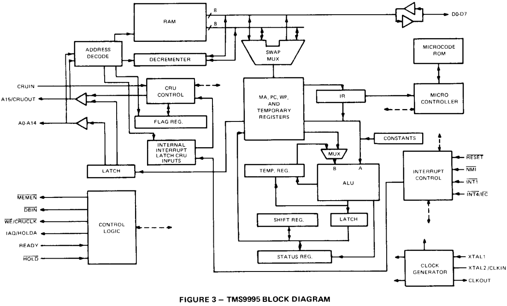
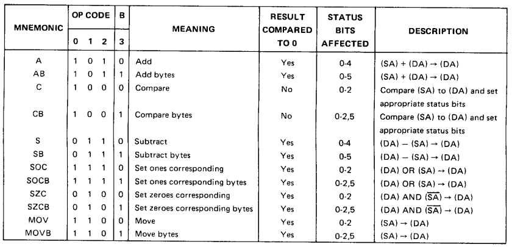
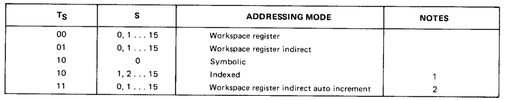
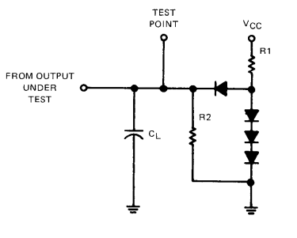

<div style="text-align: center">
TEXAS INSTRUMENTS 

9900 

TMS 9995 

16-Bit Microcomputer 

MICROPROCESSOR SERIES

Data Manual 
</div>

<hr style="page-break-before: always;" />

TABLE OF CONTENTS 

```
1. INTRODUCTION 
1.1 Description 
1.2 Key Features 

2. ARCHITECTURE 

2.1 Memory Allocation 
2.2 TMS 9995 Organization 
2.2.1 Arithmetic Logic Unit 
2.2.2 Internal Registers 
2.3 TMS 9995 Interfaces 
2.3.1 TMS 9995 Memory Interface 
2.3.2 TMS 9995 Interrupts 
2.3.3 Communication Register Unit Interface 
2.3.4 External Instructions 
2.3.5 TMS 9995 Internal ALU/Other Operation Cycles 


3. TMS 9995 PIN DESCRIPTION 

4. TMS 9995 INSTRUCTION SET

4.1 Definition 
4.2 Addressing Modes 
4.2.1 Workspace Register Addressing, R 
4.2.2 Workspace Register Indirect Addressing, *R 
4.2.3 Workspace Register Indirect Auto Increment Addressing, *R+ 
4.2.4 Symbolic (Direct) Addressing, @LABEL 
4.2.5 Indexed Addressing, @TABLE(R) 
4.2.6 Immediate Addressing 
4.2.7 Program Counter Relative Addressing 
4.2.8 CRU Relative Addressing 
4.3 Definition of Terminology 
4.4 Status Register Manipulation 
4.5 Instructions 
4.5.1 Dual Operand Instructions with Multiple Addressing for Source and Destination Operand 
4.5.2 Dual Operand Instructions with Multiple Addressing Modes for the Source Operand and Workspace Register Addressing for the Destination 
4.5.3 Signed Multiply and Divide Instructions 
4,5.4 Extended Operation (XOP) Instructions 
4.5.5 Single Operand Instructions 
4.5.6 CRU Multiple-Bit Instructions 
4.5.7 CRU Single Bit Instructions 
4.5.8 Jump Instructions 
4.5.9 Shift Instructions 
4.5.10 Immediate Register Instructions 
4.5.11 Internal Register Load Immediate Instructions 
4.5.12 Internal Register Load and Store Instructions 
4.5.13 Return Workspace Pointer (RTWP) Instruction 
4.5.14 External Instructions 
4.5.15 Mid Interrupt Codes 
4.6 Instruction Execution 
4.6.1 Microinstruction Cycle 
4.6.2 Execution Sequence 
4.6.3 Instruction Execution Times 

TABLE OF CONTENTS (Concluded) 

5. ELECTRICAL CHARACTERISTICS 

5.1 Absolute Maximum Ratings 
5.2 Recommended Operating Conditions 
5.3 Electic Characteristics
5.4 Clock Characteristics 
5.4.1 Internal Clock Option 
5.4.2 External Clock Option 
5.5 Timing Requirements 
5.6 Switching Characteristics 

6. MECHANICAL SPECIFICATIONS 

LIST OF ILLUSTRATIONS 

Figure 1 Word and Byte Formats 
Figure 2 TMS 9995 Memory Map 
Figure 3 TMS 9995 Block Diagram 
Figure 4 TMS 9995 Flow Chart 
Figure 5 Status Register Bit Assignments 
Figure 6 Workspace Registers Usable As Index Registers 
Figure 7 Workspace Pointer and Registers 
Figure 8 TMS 9995 Memory Interface 
Figure 9 TMS 9995 Memory Read Cycle 
Figure 10 Memory Write Cycle 
Figure 11 TMS 9995 Hold State 
Figure 12 Decrementer Functional Block Diagram 
Figure 13 Wait State Generation for External Memory, External CRU Cycles, and External Instruction Cycles 
Figure 14 External Circuitry for Invoking/Inhibiting Automatic First Wait State Generation Feature 
Figure 15 TMS 9995 Reset Signal Timing Relationships 
Figure 16 TMS 9995 NMI Signal Timing Relationships 
Figure 17 Functional Block Diagram of Internal Interrupt Request Latch 
Figure 18 TMS 9995 CRU Interface 
Figure 19 CRU Address Map 
Figure 20 TMS 9995 CRU Input Cycle 
Figure 21 TMS 9995 CRU Output Cycle 
Figure 22 Single Bit CRU Address Development 
Figure 23 LDCR/STCR Data Transfers 
Figure 24 Pin Assignments 
Figure 25 Internal Oscillator 
Figure 26 External Oscillator 
Figure 27 TMS 9995 Clock Timing 
Figure 28 TMS 9995 Memory Interface Timing 
Figure 29 TMS 9995 CRU External Instruction Timing 
Figure 30 TMS 9995 RESET and NMI Timing 
Figure 31 TMS 9995 HOLD Timing 
Figure 32 TMS 9995 Interrupt Input Timing 
Figure 33 TMS 9995 Event Counter Input Timing 
Figure 34 Measurement Points for Switching Characteristics 
Figure 35 Switching Characteristics Test Load Circuit 

LIST OF TABLES 

Table 1 Dedicated Workspace Registers 
Table 2 Interrupt Level Data 
Table 3 Flag Register Bit Definitions 
Table 4 TMS 9995 External Instruction Codes 
Table 5 TMS 9995 Pin Description 
Table 6 Definition of Terminology 
Table 7 Status Register Bit Definitions 
Table 8 Execution Sequence Example 
Table 9 Instruction Execution Times 
Table 10 Operation Address Derivation
Table 11 Instruction Execution Time Examples

```

<hr style="page-before-break: always:" />

# 1. INTRODUCTION 

## 1.1 DESCRIPTION 

The TMS 9995 microcomputer is a single-chip 16-bit central processing unit (CPU) with 256 bytes of on-chip random access memory (RAM). A member of the TMS 9900 family of microprocessor and peripheral circuits, the TMS 9995 is fabricated using N-channel silicon-gate MOS technology. The rich instruction set of the TMS 9995 is based upon a unique memory-to-memory architecture that features multiple register files resident in memory. Memory-resident register files allow faster response to interrupts and increased programming flexibility. The inclu- sion of RAM, timer function, clock generator, interrupt interface, and a flexible flag register on-chip facilitates support of small system implementations. 

All members of the TMS 9900 family of peripheral circuits are compatible with the TMS 9995. Providing a per- formance upgrade to the TMS 9900 microprocessor, the TMS 9995 instruction set is an opcode-compatible super- set of the TMS 9900 processor family. 

## 1.2 KEY FEATURES 

* 16-Bit instruction word 
* Memory-to-Memory architecture 
* 65,536 byte/32,768 word directly addressable memory address space 
* Minicomputer instruction set including signed multiply and divide instructions 
* Multiple 16-word register files (Workspaces) residing in memory 
* 256 bytes of on-chip RAM 
* Separate memory and interrupt bus structures 
* 8-Bit memory data bus 
* 7 prioritized hardware interrupts 
* 16 software interrupts (XOPS) 
* Programmed and DMA I/O capability 
* Serial I/O via communication register unit (CRU) 
* On-chip time/event counter 
* On-chip programmable flags (16) 
* Macro instruction detection (MID) feature 
* Automatic first wait state generation feature 
* Single 5-volt supply 
* 40-pin package 
* N-Channel silicon gate MOS technology 
* On-chip clock generator 

# 2. ARCHITECTURE 

## 2.1 MEMORY ALLOCATION 

The basic word of the TMS 9995 architecture is 16 bits in length. These 16 bits are divided into 8-bit bytes for external memory in the manner shown in Figure 1. A word is, therefore, defined as two consecutive 8-bit bytes in memory. All words (instruction opcodes, operand addresses, word-length data, etc.) are restricted to even address boundaries, i.e., the most significant half, or 8 bits, resides at an even address and the least significant half resides at the subsequent odd address. Any memory access involving a full word that is directed by software to utilize an odd address will result in the word starting with this odd address minus one to be accessed. 

 <figure>
 
 <figcaption>FIGURE 1 -- WORD AND BYTE FORMATS</figcaption>
 </figure>
 
The instruction set of the TMS 9995 allows both word and byte operations. Byte instructions may address either byte as necessary. A byte access of this type will not affect the other byte of the word involved since the other byte will not be accessed during the execution of the byte instruction. 

The TMS 9995 memory map is shown in Figure 2. Shown are the locations in the memory address space for the Reset, NMI, other interrupt and XOP trap vectors, and the dedicated address segments for the on-chip RAM and the on-chip memory-mapped 1/0. 

 <figure>
 
 <figcatpion>FIGURE 2 - TMS9995 MEMORY MAP </figcatpion>
 </figure>


## 2.2 TMS 9995 ORGANIZATION 

The block diagram of the TMS 9995 is shown in Figure 3. A flow chart, representative of the TMS 9995 functional operation, is shown in Figure 4. 

 <figure>
 
 <figcaption> FIGURE 3 TMS9995 BLOCK DIAGRAM </figcaption> 
 </figure>

 <figure>
 
 <figcaption>FIGURE 4 – TMS9995 FLOW CHART </figcaption>
 </figure>

### 2.2.1 Arithmetic Logic Unit 

The arithmetic logic unit (ALU) is the computational component of the TMS 9995. It performs all arithmetic and logic functions required to execute instructions. The functions include addition, subtraction, AND, OR, exclusive OR, and complement. A separate comparison circuit performs the logic and arithmetic comparisons to control bits O through 2 of the status register. The ALU is arranged in two 8-bit halves to accommodate byte operations. Each half of the ALU operates on one byte of the operand. During word operand operations, both halves of the ALU function in conjunction with each other. However, during byte operand processing, results from the least significant half of the ALU are ignored. The most-significant half of the ALU performs all operations on byte operands so that the status circuitry used in word operations is also used in byte operations. 

### 2.2.2 Internal Registers 

The following three (3) internal registers are accessible to the user (programmer): 

* Program Counter (PC) 
* Status Register (ST) 
* Workspace Pointer (WP) 

#### 2.2.2.1 Program Counter 

The program counter (PC) is a 15-bit counter that contains the word address of the next instruction following the instruction currently executing. The microprocessor references this address to fetch the next instruction from memory and increments the address in the PC when the new instruction is executing. If the current instruction in the microprocessor alters the contents of PC, then a program branch occurs to the location specified by the altered contents of PC. All context switching (see Section 2.2.2.3.2) operations plus simple branch and jump instructions affect the contents of PC. 

#### 2.2.2.2 Status Register 

The status register (ST) is a fully implemented 16-bit register that reports the results of program comparisons, indi- cates program status conditions, and supplies the arithmetic overflow enable and interrupt mask level to the inter- rupt priority circuits. Each bit position in the register signifies a particular function or condition that exists in the microprocessor. Figure 5 illustrates the bit position assignments. Some instructions use the status register to check for a prerequisite condition; others affect the values of the bits in the register; and others load the entire status register with a new set of parameters. Interrupts also modify the status register. The description of the instruction set later in this document details the effect of each instruction on the status register (see Section 3). 

 <figure>
 
 <figcaption>

* ST7, ST8, ST9, and ST11 are not used in the TMS9995, but still physically exist in the register. These bits could therefore be used as flag bits, but software transportability should be kept in mind when doing so as these bits are defined in other 9900 microprocessor family and 990 minicomputer family products. 

+ Do not allow the overflow Interrupt Enable bit (ST10 OV EN) to be set to 1 as the arithmetic overflow is not functional on current devices. This will be corrected at a later date. 

 |||||||
 |--|--|--|--|--|--|
 L> | Logical Greater Than C | Carry Out | X | XOP In Progress |
 A> |Arithmetic Greater Than OV |Overflow |OV EN |Overflow Interrupt Enable 
 EQ | Equal/TB Indicator |OP | Parity (Odd No. of Bits) ||


#### 2.2.2.3 Workspace 

The TMS 9995 uses blocks of memory words called workspaces for instruction operand manipulation, A work- space occupies 16 contiguous words in any part of memory that is not reserved for other use. The individual workspace registers may contain data or address, or function as operand registers, accumulators, address registers, or index registers. Some workspace registers take on special significance during execution of certain instructions. Table 1 lists each of these dedicated workspace registers and the instructions that use them. Figure 6 defines the workspace registers that are allowed to be used as index registers. 


 TABLE 1 - DEDICATED WORKSPACE REGISTERS 

 REGISTER NO.|CONTENTS |USED DURING
 |--|--|--| 
 0 |Shift count (optional) |Shift instructions (SLA, SRA, 
SRC, and SLC) 
 |Multiplicand and MSW<br>of result | Signed Multiply 
 |MSW of dividend and<br>quotient |Signed Divide 
 1|LSW of result| Signed Multiply
 |LSW of dividend and<br>remainder| Signed Divide 
 11|Return Address|Branch and Link Instruction (BL) 
 |Effective Address |Extended Operation (XOP) 
 12|CRU Base Address 
13|Saved WP register 
14|Saved PC register 
15|Saved ST register 

DATA 
OR 
ADDRESSES 
CRU instructions (SBO, SBZ, TB, LDCR, and STCR) 
Context switching (BLWP, RTWP, XOP, interrupts) 
Context switching (BLWP, RTWP, XOP, interrupts) 
Context switching (BLWP, RTWP, XOP, interrupts) 
WORKSPACE REGISTERS 
0 
1 
23 
4 
5 
1 6 
росси 
7 
8 
9 
10 
INDEX 
CAPABILITY 
11 
12 
13 
14 
15 
NOTE: The WP register contains the address of workspace register zero. 
FIGURE 6 
WORKSPACE REGISTERS USABLE AS INDEX REGISTERS 
6 
##### 2.2.2.3.1 Workspace Pointer 

To locate the workspace in memory, a hardware register called the workspace pointer (WP) is used. The workspace pointer is a 16-bit register that contains the memory address of the first word in the workspace. The address is left-justified with the 16th bit (LSB) hardwired to logic zero. The TMS 9995 accesses each register in the work- space by adding twice the register number to the contents of the workspace pointer and initiating a memory re- quest for that word. Figure 7 illustrates the relationship between the workspace pointer and its corresponding workspace in memory

WORKSPACE POINTER 
(WP) 
WORKSPACE 
ADDRESS 
WORKSPACE REGISTERS 
WP 
0 
WP + 0016 
1 
WP + 0216 
2 
WP + 0416 
3 
WP + 0616 
MICROPROCESSOR ADDS 
WORKSPACE POINTER (WP) TO TWICE THE REGISTER NUMBER TO 
DERIVE ACTUAL REGISTER ADDRESS 
WP + 0816 
5 
WP + 0A16 
6 
WP + 0C16 
7 
WP + 0E 16 
8 
WP + 1016 
9 
WP + 1216 
10 
WP + 1416 
WP + 1616 
11 
WP + 1816 
12 
NOTE: All memory word addresses are even, 
WP + 1A16 
13 
14 
WP + 1C16 
WP + 1E16 
15 

FIGURE 7 WORKSPACE POINTER AND REGISTERS 

For instructions performing byte operations, use of the workspace register addressing mode (see Section 3.2) will result in the most significant byte of the workspace register involved to be used as the operand for the operation. Since the workspace is also addressable as a memory address, the least significant byte may be directly addressed using any one of the general memory addressing modes. 

##### 2.2.2.3.2 Context Switching 

The workspace concept is particularly valuable during operations that require a context switch, which is a change from one program environment to another, as in the case of a subroutine or an interrupt service routine. Such an operation using a conventional multi-register arrangement requires that at least part of the contents of the register file be stored and reloaded using a memory cycle to store or fetch each word. The TMS 9995 accomplishes this operation by changing the workspace pointer. A context switch requires only three store cycles and two fetch cycles, exchanging the program counter, status register and workspace pointer. After the switch, the workspace pointer contains the starting address of a new 16-word workspace in memory for use in the new routine. A corre- sponding time saving occurs when the original context is restored. Instructions in the TMS 9995 that result in a context switch include: Call subroutine (BLWP), Return from Subroutine (RTWP) and the Extended Operation (XOP) instruction. All interrupts also cause a context switch by forcing the TMS 9995 to trap to a service sub- routine. 

## 2.3 TMS 9995 INTERFACES 

Each TMS 9995 system interface uses one or more of the signals from one or more of the signal groupings given in the pin description list in Section 3. Each interface is described in detail in the following paragraphs. 

### 2.3.1 TMS 9995 Memory Interface 

The signals used in the TMS 9995 interface to system memory are shown in Figure 8. 


A0-A14, A15/CRUOUT 
DO-D7 
MEMEN 
DBIN 
TMS9995 
WE/CRUCLK 
READY 
IAQ/HOLDA 
HOLD 
MEMORY SYSTEM 
AND/OR DMA CONTROLLER 
IAQ/HOLDA AND 
HOLD ARE NOT REQUIRED FOR SIMPLE MEMORY SYSTEMS BUT WILL 
BE USED BY DMA 
CONTROLLERS 

FIGURE 8 TMS9995 MEMORY INTERFACE 

#### 2.3.1.1 External Memory Address Space 

The details of memory accesses that are external to the TMS 9995 (off-chip accesses) are given in the following paragraphs. (See Figure 2 for the addresses that are in the external memory-address space.) 

##### 2.3.1.1.1 Memory Read Operations 

To perform a memory read operation, the TMS 9995 first outputs the appropriate address on A0-A14 and A15/ CRUOUT, and asserts MEMEN. The TMS 9995 then places its data bus drivers in the high impedance state, asserts DBIN, and then reads in the data byte. Completion of the memory read cycle and/or generation of Wait states is determined by the READY input as detailed in Section 2.3.1.3. Timing relationships of the memory read sequence are shown in Figure 9. Note that MEMEN remains active (low) between consecutive memory operations. 

CLKOUT 
A0-A14, A15/CRUOUT 
NOTES: 
2 
DO-D7 
3 
MEMEN 
DBIN 
WE/CRUCLK 
IAQ/HOLDA 
MEMORY READ 
MEMORY READ 
NO WAIT STATE 
ONE WAIT STATE 
I 
1. Valid address 
2. In input mode (drivers @ High-Z) 
3. Memory Read Data must be valid at CLKOUT edge indicated 
4. IAQ/HOLDA will only be asserted during memory read cycles if an instruction opcode is being read (timing shown is for an instruc- tion fetch from external memory -, i.e., two consecutive byte reads). 

FIGURE 9. TMS9995 MEMORY READ CYCLE 

Although not explicitly shown in Figure 9, reading a word (two 8-bit bytes) from external memory requires two memory read cycles that occur back-to-back (a Hold state request will not be granted between cycles). If an instruction directs that a byte read from external memory is to be performed, only the byte specifically addressed will be read (one memory read cycle). External words are accessed most-significant (even) byte first, followed by the least-significant (odd) byte. 

During memory read cycles in which an instruction opcode is being read, IAQ/HOLDA is asserted as shown in Figure 9. Note that since an instruction opcode is a word in length, IAQ/HOLDA remains asserted between the two byte read operations involved when an instruction opcode is read from the external memory address space. 

##### 2.3.1.1.2 Memory Write Operations 

To perform a memory write operation, the TMS 9995 first outputs the appropriate address on A0-A14 and A15/ CRUOUT, and asserts MEMEN. The TMS 9995 then outputs the data byte being written to memory on pins DO through D7, and then asserts WE/CRUCLK. Completion of the memory write cycle and/or generation of Wait states is determined by the Ready input as detailed in Section 2.3.1.3. Timing relationships of the memory write sequence are shown in Figure 10. Note that MEMEN remains active (low) between consecutive memory operations. 

CLKOUT 
A0-A14, A15/CRUOUT 
NOTES: 
DO-D7 
MEMEN 

DBIN 
WE/CRUCLK 
IAQ/HOLDA 
Valid address 
MEMORY WRITE 
NO WAIT STATE 
Valid memory write data 
IAQ/HOLDA will never be asserted during a memory write cycle 
MEMORY WRITE ONE WAIT STATE 

FIGURE 10 - TMS9995 MEMORY WRITE CYCLE 

Writing a word (two 8-bit bytes) to external memory requires two memory write cycles that occur back-to-back, (A Hold state request will not be granted between cycles.) If an instruction directs that a byte write to external memory is to be performed, only the byte specifically addressed will be written (one memory write cycle). External words are accessed most-significant (even) byte first followed by the least-significant (odd) byte. 

##### 2.3.1.1.3 Direct Memory Access 

The TMS 9995 Hold state allows both external devices and the TMS 9995 to share a common external memory. To gain direct memory access (DMA) to the common memory, the external device first requests the TMS 9995 to enter a Hold state by asserting (taking low) the HOLD input. The TMS 9995 will then enter a Hold state following completion of the cycle (either memory, CRU, external Instruction, or internal ALU cycles) that it is currently performing. Note, however, that a Hold state is not entered between the first and second byte accesses of a full word in the external memory address space, and a Hold state is not entered between the first and second clock cycles of a CRU cycle. 

Upon entry of a Hold state, the TMS 9995 puts its address, data, DBIN, and WE/CRUCLK drivers in the high impedance mode, and asserts IAQ/HOLDA. The external device can then utilize these signal lines to communicate with the common memory. After the external device has completed its memory transactions, it releases HOLD, and the TMS 9995 continues instruction execution at the point where it had been suspended. Timing relationships for this sequence are shown in Figure 11. 

CLKOUT 
AO-A14, A15/CRUOUT 
00-07 
MEMEN 
DBIN 
WE/CRUCLK 
HOLD 
IAQ/HOLDA 
NOTES: 
4 
VALID ADDRESS 
VALID WRITE DATA 
MEMORY WRITE, NO WAIT 
STATES 
ANY NUMBER OF COMPLETE CLKOUT CYCLES 
4 
se 
HOLD STATE 
10 
NEXT CYCLE (MEMORY, CRU, EXTERNAL INSTRUCTION, OR INTERNAL ALU CYCLE) 
Cycle before the hold state could have been memory (with any number of wait states), CRU, external instruction, or internal ALU HOLD must be valid at last low-to-high CLKOUT transition of a cycle for next low-to-high CLKOUT transition to begin a hold state 
In high-impedance mode (output drivers) 
Next cycle will begin after first low-to-high CLKOUT transition at which HOLD is high 
- 

FIGURE 11 – TMS9995 HOLD STATE 

To allow DMA loading of external memory on power-up, the TMS 9995 does not begin instruction execution after a Reset state until HOLD has been removed if HOLD was active (low) at the time RESET was taken from low to high RESET released). 

External devices cannot access the internal (on-chip) memory address space of the TMS 9995 when it is in the Hold state. 

Since IAQ (Instruction Opcode Acquisition) and HOLDA (Hold Acknowledge) are multiplexed on a single signal, IAQ/HOLDA, this signal must be gated with MEMEN using external logic to separate IAQ and HOLDA, When MEMEN = 0, IAQ/HOLDA can indicate IAQ, and when MEMEN = 1, IAQ/HOLDA can indicate HOLDA. 

#### 2.3.1.2 Internal Memory Address Space 

Access of the internal (on-chip) memory address space is transparent to the TMS 9995 instruction set. That is, operands can be read from and written into locations in the internal memory space simply by using the appro- priate addresses via any of the addressing modes in the TMS 9995 instruction set, and instructions can even be executed from the internal memory space by loading the appropriate address into the program counter of the TMS 9995. 

The TMS 9995 indicates to the external world when these internal memory address space accesses are occurring by asserting the same signals used for accessing external memory (see Figure 8) in a manner very similar to an ex- ternal memory address space access. There are a few differences in these cycles, however, and these differences are detailed in the following paragraphs. 

When performing an internal memory address space access, the TMS 9995 outputs the same signals that it would for an external memory space access, with the same timing (see Figures 9 and 10) except for the following: 
 
1. A single cycle (read or write) is output as both internal bytes are accessed simultaneously. (Externally, it appears as though a single byte memory access cycle to an internal address is occurring.) 
2. The cycle always has no Wait states, and the READY input is ignored by the TMS 9995 (see Section 2.3.2.3). 
3. During read cycles, the data bus (DO-D7) output drivers are put in the high-impedance mode. During write cycles, the data bus outputs non-specific data.

During read cycles to the internal memory address space, the TMS 9995 does not make the read data available to the external world. If an instruction is executed from the internal memory address space, IAQ/HOLDA is still asserted, but only during the one read cycle shown externally while the full word is read internally. 

When in a Hold state, external devices are not able to access the internal memory address space. 

##### 2.3.1.2.1 Internal RAM 

The 256 bytes of internal random-access read/write memory (RAM), the memory addresses of which are shown in Figure 2, are organized internally as 128 16-bit words. Since the TMS 9995 has 16-bit internal data paths, two 8-bit bytes are accessed each time a memory access is made to the internal RAM. 

Byte accesses are transparent to the internal RAM. That is, when an instruction addresses a byte in the internal RAM, the TMS 9995 will: (1) read the entire word but only use the byte specifically addressed for a read opera- tion and, (2) only write to the specifically addressed byte and not alter the contents of the other byte in the word during a write operation. 

##### 2.3.1.2.2 Decrementer (Timer/Event Counter) 

Accessible via one of the word addresses (see Figure 2) of the internal memory-mapped I/O address space is the de- crementer. The on-chip decrementer logic can function as a programmable real-time clock, an event timer, or as an external event counter. A block diagram of the decrementer that is representative of its functional operation (but not necessarily representative of its specific logic implementation) is shown in 
Figure 12. 

FIGURE 12 -- DECREMENTER FUNCTIONAL BLOCK DIAGRAM 

The decrementer is configured as either a timer or an event counter using bit FLAGO of the internal Flag register. The decrementer is enabled/disabled using bit FLAG1 of the internal Flag register. (See Section 2.3.3.2.1 for de- tails of the Flag register and accessing the bits in it.) When FLAGO is set to zero, the decrementer will function as a timer. When FLAGO is set to one, the decrementer will function as an event counter. When FLAG1 is set to zero, the decrementer is disabled and will not be allowed to decrement and request level 3 interrupt traps. When FLAG1 is set to one, the decrementer is enabled and will decrement and request level 3 interrupt traps. It should be noted that when the decrementer is configured as a timer, INT4/EC will be usable as an external interrupt level 4 trap request. When the decrementer is configured as an event counter, INT4/EC is the input for the "event counter" pulses, and an interrupt level 4 trap request input is no longer available externally or internally. 

The general operation of the decrementer is as follows, FLAGO of the Flag register is first set to select the desired mode of operation. The desired start count is then loaded into the Starting Count Storage Register by performing a memory write of the count word to the dedicated internal memory mapped I/O address of the decrementer. (This also loads the Decrementing Register with the same count.) The decrementer is then enabled and allowed to start decrementing by setting FLAG1 of the Flag Register to one. (Both FLAGO and FLAG1 are set to zero when the TMS 9995 is reset. (See Section 2.3.2.1.1.) When the count in the Decrementing Register reaches zero, the level 3 internal interrupt request latch is set (see Section 2.3.2.2.3), the Decrementing Register is reloaded from the Starting Count Storage Register, and decrementing continues. Note that writing a start count of 000016 to the decrementer will disable it. 

When configured as a timer, the decrementer functions as a programmable real-time clock by decreasing the count in the Decrementing Register by one for each fourth CLKOUT cycle. Loading the decrementer with the appro- priate start count causes an interrupt to be requested every time the count in the Decrementing Register reaches zero. The decrementer can also be used as an event timer when configured as a timer by reading the decrementer (which is accomplished by performing a memory read from the dedicated internal memory mapped I/O address of the decrementer) at the start and stop points of the event of interest and comparing the two values. The dif- ference will be a measurement of the elapsed time. 

When configured as an event counter, operation is as previously discussed except that each high-to-low transition on INT4/EC will cause the Decrementing Register to decrement. These INT4/EC high-to-low transitions can be asynchronous with respect to CLKOUT. Note that INT4/EC can function as a negative edge-triggered interrupt by loading a start count of one. 

The decrementer should always be accessed as a full word (two 8-bit bytes). Reading a byte from the decrementer does not present a problem since only the byte specifically addressed will be read. Writing a single byte to either of the bytes of the decrementer will result in the data byte being written into the byte specifically addressed and random bits being written into the other byte of the decrementer. 

#### 2.3.1.3 Wait State Generation 

Wait states can be generated for external memory cycles, external CRU cycles and external instruction cycles for the TMS 9995 using the READY input. A Wait state is defined as extension of the present cycle by one CLKOUT cycle. The timing relationships of the READY input to the memory interface and the CRU interface signals are shown in Figure 13. Note that Wait states cannot be generated for memory cycles that access the internal memory address space or for CRU cycles that access the internal CRU address space, as the READY input will be ignored during these cycles. 

The Automatic First Wait State Generation feature of the TMS 9995 allows a Wait state to be inserted in each ex- ternal memory cycle, regardless of the READY input, as shown in Figure 13. The Automatic First Wait State Generation feature can be invoked when RESET is asserted. If READY is active (high) when RESET goes through a low-to-high transition, the first Wait state in each external memory cycle will be automatically generated. If READY is inactive (low) when RESET goes through a low-to-high transition, no Wait state will be inserted auto- matically in each external memory cycle. There is a one and one-half CLKOUT cycle time minimum setup time requirement on READY before the RESET low-to-high transition. The recommended external circuitry for invoking or inhibiting the Automatic First Wait State Generation feature is shown in Figure 14. Note that this feature does not apply to internal memory address space accesses, external instruction cycles, or any CRU cycles. Wait states cannot be generated during internal ALU/other operation cycles. The READY input is ignored during these cycles. 

FIGURE 13 -- WAIT STATE GENERATION FOR EXTERNAL MEMORY, EXTERNAL CRU CYCLES, AND EXTERNAL INSTRUCTION CYCLES 

FIGURE 14 -- EXTERNAL CIRCUITRY FOR INVOKING/INHIBITING AUTOMATIC FIRST WAIT STATE GENERATION FEATURE 

### 2.3.2 TMS 9995 Interrupts 

The TMS 9995 implements seven prioritized, vectored interrupts, some of which are dedicated to predefined func- tions and the remaining are user-definable. Table 2 defines the source (internal or external), assignment, priority level, trap vector location in memory, and enabling/resulting status register interrupt mask values for each interrupt. 

TABLE 2 - INTERRUPT LEVEL DATA 

 |PRIORITY <br>LEVELS <br>(In Order of Priority) |VECTOR <br>LOCATION <br>(Memory <br>Address, <br>In Hex) |MASK VALUES <br>TO ENABLE <br>ACCEPTING <br>THE INTERRUPT <br>(ST12 THRU ST15) |MASK VALUE <br>AFTER TAKING <br>THE INTERRUPT<br> (ST12 THRU ST15)| SOURCE AND <br>ASSIGNMENT|
 |--|--|--|--|--| 
 |0<br>(Highest Priority)  |0000 |016 thru F16 |0000|External: Reset <br>(RESET Signal) 
 |MID |0008 <br>(see Note 2) |016 thru F16 <br>(see Note 1) |0001 <br>(see Note 2) |Internal: MID 
 |NMI |FFFC |016 thru F16 <br>(see Note 1)|0000 |External: User-<br> defined (NMI <br>Signal) 
 |1 |0004 |1 16 thru F 16 |0000 |External: User- <br>defined (INT1 <br>Signal) 
 |2<br>(see Note 5) |0008<br> (see Note 2) |216 thru F 16<br>(see Note 3)  |0001 <br>(see Note 2) |Internal:<br> Arithmetic Overflow 
 |3 |000C |316 thru F16 |0002 |Internal: <br>Decrementer 
 |4 |0010 |416 thru F 16 |0003|External: User- <br> defined (INT4/EC <br>Signal; see Note 4). 


NOTES: 
1. Level 0, MID, and NMI cannot be disabled with the Interrupt Mask. 
2. MID and Level 2 use the same trap vector and change the Interrupt Mask to the same value. 
3. Generation of a Level 2 request by an Arithmetic Overflow condition (ST4 set to 1) is also enabled/disabled by bit ST10 of the 
Status Register. 
1. INT4/EC is not an input for Level 4 interrupt trap requests (Level 4 is not usable) when the Decrementer is configured as an 
Event Counter. 
1. Priority Level 2 Internal Arithmetic Overflow should not be used as the arithmetic overflow is not functional on current devices. 
This will be corrected at a later date.

The TMS 9995 will grant interrupt requests only between instructions (except for Level 0 Reset), which will be granted whenever it is requested, i.e., in the middle of an instruction). The TMS 9995 performs additional func- tions for certain interrupts, and these functions will be detailed in subsequent sections. The basic sequence that the TMS 9995 performs to service all interrupt requests is as follows: 
 
1. Prioritize all pending requests and grant the request for the highest priority interrupt that is not masked by the current value of the interrupt mask in the status register or the instruction that has just been executed. (See Section 4.5 for these instructions.) 
2. Make a context switch using the trap vector specified for the interrupt being granted. 
3. Reset ST7 through ST11 in the status register to zero, and change the interrupt mask (ST12 through ST15) as appropriate for the level of the interrupt being granted. 
4. Resume execution with the instruction located at the new address contained in the PC, and using the new WP. All interrupts will be disabled until after this first instruction is executed, unless: (a) RESET is requested, in which case it will be granted, or (b) the interrupt being granted is the MID request and the NMI interrupt is requested simultaneously (in which case the NMI request will be granted before the first instruction indicated by the MID trap vector is executed.) 

This sequence has several important characteristics. First of all, for those interrupts that are maskable with the interrupt mask in the status register, the mask will get changed to a value that will permit only interrupts of higher priority to interrupt their service routines. Secondly, status bit ST10 (overflow interrupt enable) is reset to zero by the servicing of any interrupt so that overflow interrupt requests cannot be generated by an unrelated program segment. Thirdly, the disabling of other interrupts until after the first instruction of the service routine is executed permits the routine to disable other interrupts by changing the interrupt mask with the first instruction. (The ex- ception with MID and NMI is explained in Section 2.3.2.2.1.) Lastly, the vectoring and prioritizing scheme of the TMS 9995 permits interrupts to be automatically nested in most cases. If a higher priority interrupt occurs while in an interrupt service routine, a second context switch occurs to service the higher priority interrupt. When that routine is complete, a return instruction (RTWP) restores the saved context to complete processing of the lower priority interrupt. Interrupt routines should, therefore, terminate with the return instruction to restore original program parameters. 
Additional details of the TMS 9995 interrupts are supplied in the following paragraphs. 

#### 2.3.2.1 External Interrupt Requests 

Each of these interrupts is requested when the designated signal is supplied to the TMS 9995. 

##### 2.3.2.1.1 Interrupt Level 0 (RESET) 

Interrupt Level O is dedicated to the RESET input of the TMS 9995. When active (low), RESET causes the TMS 9995 to stop instruction execution and to inhibit (take to logic level high) MEMEN, DBIN, and WE/CRUCLK. The TMS 9995 will remain in this Reset state as long as RESET is active. 

When RESET is released (low-to-high transition), the TMS 9995 performs a context switch with the Level O inter- rupt trap vector (WP and PC of trap vector are in memory word addresses 000016 and 000216, respectively.) Note that the old WP, PC and ST are stored in registers 13, 14, and 15 of the new workspace. The TMS 9995 then resets all status register bits, the internal interrupt request latches (see Sections 2.3.2.1.3 and 2.3.2.2.3 for details of these latches), Flag Register bits FLAGO and FLAG1 (see Section 2.3.3.2.1 for details of the Flag Register), and the MID Flag (see Section 2.3.3.2.2). After this, the TMS 9995 starts execution with the new PC. 

If HOLDA is active (high) due to HOLD being active (low) when RESET becomes active, RESET will cause HOLDA to be released (taken low) at the same time as MEMEN, DBIN, and WE/CRUCLK are taken inactive (high). HOLD can remain active as long as RESET is active and HOLDA will not be asserted. If HOLD is active when RESET is released (low-to-high transition), HOLDA will be asserted before the RESET context switch occurs and the TMS 9995 will remain in this hold state until HOLD is released. This RESET and HOLD priority scheme facilitates DMA loading of external RAM upon power-up. 

Timing relationships of the RESET signal are shown in Figure 15. 

Release of the RESET signal is also the time at which the Automatic First Wait State function of the TMS 9995 can be invoked (see Section 2.3.1.3). 

FIGURE 15 TMS9995 RESET SIGNAL TIMING RELATIONSHIPS 

NOTES:

1. Don't care XXX indicates that any type of TMS9995 cycle can be taking place 
2. RESET is sampled at every high-to-low CLKOUT transition 
3. RESET is required to be active (low) for a minimum of four samples to initiate the sequence. The context switch would begin one CLKOUT cycle after 3 if RESET were inactive (high) at 3 
4. The context switch using the Reset trap vector begins one CLKOUT cycle after RESET is sampled as having returned to the inactive (high) level. 

##### 2.3.2.1.2 Non-Maskable Interrupt (NMI) 

The NMI signal is the request input for the NMI level interrupt and allows ROM loaders, single-step/breakpoint/ maintenance panel functions, or other user-defined functions to be implemented for the TMS 9995. This signal and its associated interrupt level are named "LOAD" in previous 9900 family products. 

NMI being active (low) according to the timing illustrated in Figure 16 constitutes a request for the NMI level interrupt. The TMS 9995 services this request exactly according to the basic sequence previously described, with the priority level, trap vector location, and enabling/resulting status register interrupt mask values as defined in Table 2. Note that the TMS 9995 will always grant a request for the NMI level interrupt immediately after execu- tion of the currently executing instruction is completed since NMI is exempt from the interrupt-disabling-after- execution characteristic of certain instructions and also the current value of the interrupt mask, 

It should also be noted that the TMS 9995 implements four bytes of its internal RAM at the memory address of the NMI vector. This allows usage of the NMI level in minimum-chip TMS 9995 systems. It also requires, however, that this vector must be initialized, upon power-up, before the NMI level interrupt can be requested. 

NOTES:

1. NMI is sampled at every high-to-low CLKOUT transition 
2. To be recognized, NMI must be active (low) at the end of an instruction. Since instructions are variable in length, the minimum active time for NMI is variable according to the instruction being executed. Shown by is the last possible time that NMI must be recognized at or by before execution of the next instruction will commence. The NMI context switch begins three CLKOUT cycles after execution of the current instruction is complete. 
3. After an NMI context switch sequence has been initiated, NMI can remain active (low) indefinitely without causing consecutive NMI trap requests. To enable another NMI trap request, NMI must be taken inactive (high) and be sampled at least once at the inactive level.
 
FIGURE 16 -- TMS9995 NMI SIGNAL TIMING RELATIONSHIPS 

##### 2.3.2.1.3 Interrupt Levels 1 and 4 (INT1 and INT4/EC) 

The INT1 and INT4/EC signals are the request inputs for the Level 1 and Level 4 interrupts, respectively. (Note that if the decrementer is configured as an event counter, INT4/EC is no longer a Level 4 interrupt request input, however. See Section 2.3.1.2.2). Levels 1 and 4 are maskable, user-definable interrupts. 

The INT1 and INT4/EC interrupt inputs can accept either asynchronous pluses or asynchronous levels as input signals. An internal interrupt request latch stores the occurrence of a pulse. A block diagram of the TMS 9995 internal logic for these request latches that is representative of their functional operation (but not necessarily representative of their specific logic implementation) is shown in Figure 17. Note that with this implementation only a single interrupt source is allowed if the input signal is a pulse, but multiple interrupt sources can be wired-ORed together provided that each source supplies a level as the input signal. (The levels are then removed one at a time by a hardware/software mechanism activated by the interrupt subroutine as each interrupting source is serviced by the subroutine.) 

NOTES:

1. A separate latch and synchronizer is implemented for Level 1 (INT1) and Level 4 (INT4/EC). For Level 1, the input shown here is directly from the INT1 pin. For Level 4 the input shown here is from the gating shown in Figure 12. 

FIGURE 17 -- FUNCTIONAL BLOCK DIAGRAM OF INTERNAL INTERRUPT REQUEST LATCH 

The TMS 9995 services each of these requests exactly according to the basic sequence previously described with the priority levels, trap vector locations, and enabling/resulting status register interrupt mask values as defined in Table 2 Each internal interrupt request latch will get reset when the context switch for its associated interrupt level occurs. 

#### 2.3.2.2 Internally Generated Interrupts 

Each of these interrupts is requested when the designated condition has occurred in the TMS 9995. 

##### 2.3.2.2.1 Macro Instruction Detection (MID) Interrupt 

The acquisition and attempted execution of an MID interrupt opcode will cause the MID level interrupt to be re- quested before execution of the next instruction begins (MID interrupt opcodes are defined in Section 4.5.15). In addition to requesting the MID level interrupt, the MID flag is set to one "1" (see Section 2.3.3.2.2). The TMS 9995 services this request exactly according to the basic sequence previously described, with the priority level, trap vector location, and enabling/resulting status register interrupt mask values as defined in Table 2. Note that the TMS 9995 will always grant a request for the MID level interrupt since MID is not affected by the interrupt mask and is higher in priority than any other interrupt except for Level 0, Reset, If the NMI interrupt is requested during an MID interrupt context switch, the MID interrupt context switch will be immediately followed by the NMI interrupt service sequence before the first instruction indicated by the MID interrupt is executed. This is done so that the NMI interrupt can be used for a single-step function with MID opcodes. Servicing the MID interrupt re- quest is viewed as "execution" of an MID interrupt opcode, NMI allows the TMS 9995 to be halted immediately after encountering an MID opcode. 

It should also be noted that the MID interrupt shares its trap vector with Level 2, the Arithmetic Overflow inter- rupt. (See Section 2.3.2.2.2.) The interrupt subroutine beginning with the PC of this vector should examine the MID Flag to determine the cause of the interrupt. If the MID Flag is set to "1", an MID interrupt has occurred, and if the MID Flag is set to "0", an Arithmetic Overflow interrupt has occurred. The portion of this interrupt sub- routine that handles MID interrupts should always, before returning from the subroutine, reset the MID Flag to "0". 

The MID interrupt has basically two applications. The MID opcodes can be considered to be illegal opcodes. The MID interrupt is then used to detect errors of this nature. The second, and primary application of the MID inter- rupt, is to allow the definition of additional instructions for the TMS 9995. MID opcodes are used as the opcodes for these macro instructions. Software in the MID interrupt service routine emulates the execution of these instruc- tions. The benefit of this implementation of macros is that the macro instructions can be implemented in micro- code in future processors and software will then be directly transportable to these future processors. 

Note that the TMS 9995 interrupt request processing sequence does create some difficulties for re-entrant usage of MID interrupt macro instructions. In general, to avoid possible errors, MID interrupt macro instructions should not be used in the NMI and Level 1 interrupt subroutines, and should only be used in the Reset subroutine if Reset is a complete initialization of the system. 

##### 2.3.2.2.2 Arithmetic Overflow Interrupt 

As the arithmetic overflow as described in this sub-section is not functional on current devices, the arithmetic over- flow interrupt ST10 should not be enabled. This will be corrected at a later date. 

The occurrence of an arithmetic overflow condition, defined as status register bit 4 (ST4) getting set to one (see Table 7. for those conditions that set ST4 to one), can cause the Level 2 interrupt to be requested. Note that this request will be granted immediately after the instruction that caused the overflow condition. The TMS 9995 ser- vices this request exactly according to the basic sequence previously described with the priority level, trap vector location, and enabling/resulting status register interrupt mask values as defined in Table 2. 

In addition to being maskable with the interrupt mask, the Level 2 overflow interrupt request is enabled/disabled by status register bit 10 (ST10), the Arithmetic Overflow Enable Bit (i.e., ST10 = 1 enables overflow interrupt re- quest; ST10 = 0 disables overflow interrupt request). If servicing the overflow interrupt request is temporarily overridden by servicing of a higher priority interrupt, the occurrence of the overflow condition will be retained in the contents of the status register, i.e., ST4 = 1, which is saved by the higher priority context switch. Returning from the higher priority interrupt subroutine via an RTWP instruction causes the overflow condition to be re- loaded into status register bit ST4 and the overflow interrupt to be requested again (upon completion of RTWP instruction). The arithmetic overflow interrupt subroutine must reset ST4 or ST10 to zero in the status word saved in register 15 before the routine is complete to prevent generating another overflow interrupt immediately after the return. 

It should also be noted that the Level 2 arithmetic overflow interrupt shares its trap vector with the MID inter- rupt. Section 2.3.2.2.1 describes how the interrupt subroutine beginning with the PC of this vector can determine the cause of the interrupt. 

##### 2.3.2.2.3 Decrementer Interrupt 

The occurrence of an interrupt request by the decrementer (see Section 2.3.1.2.2) will cause the Level 3 internal interrupt request latch to get set. This latch is similar to those for Levels 1 and 4 in that it is reset by servicing a Reset interrupt or when the context switch for its associated interrupt level occurs (Figure 17). 
The Level 3 internal interrupt request latch being set constitutes a request for a Level 3 interrupt, and the TMS 9995 services this request exactly according to the basic sequence previously described with the priority level, trap vector location, and enabling/resulting status register interrupt mask values as defined in Table 2. 

### 2.3.3 Communication Register Unit Interface 

The TMS 9995 accomplishes bit I/O of varying field width through the use of the Communications Register Unit (CRU), In applications demanding a bit-oriented I/O interface, the CRU performs its most valuable act: transferring a specified number of bits to or from memory and a designated device. Thus, the CRU is simply a linking mechanism between memory and peripherals. 

Acting as a shift register, the CRU is a separate hardware structure of the TMS 9995 microprocessor. This structure can serially transfer up to 16 bits of data between the CPU and a specified device in a single operation. The 32768-bit CRU address space may be divided into any combination of devices, each containing any number of input or output bits. When given the bit address of a device, the CRU can test or modify any bit in that unit. Several consecutive addresses can be occupied by a device. These CRU applications are controlled by single and multiple-bit 9995 instructions. 

Single-bit instructions facilitate the testing or modification of a particular bit in a device. The device in which a bit is to be tested (TB), set to zero (SBZ), or set to one (SBO) is designated by the sum of the value in Register 12 and an 8-bit signed displacement value included as an operand of that instruction. Details of these instructions are given in Section 4.5.7. 

Multiple-bit instructions control the serial transfer of up to 16 bits between memory and peripherals. The device with which communication is to take place is addressed by Register 12. The memory address to or from which data is to be transferred, as well as the number of bits to be transferred are included as operands of the multiple- bit instruction. Details of these instructions are given in Section 4,5,6. 

The signals used in the TMS 9995 interface to the CRU are shown in Figure 18. The CRU address map is shown in Figure 19. 

NOTE: 

DO-D2 are used to distinguish between CRU and external instruction cycles. If external instructions are not used in a system, D0-02 are not necessary in the CRU interface. 


FIGURE 18 - TMS9995 CRU INTERFACE 


NOTE: 

These hex addresses are the software base addresses and are obtained by placing the 15-bit Address Bus CRU bit address in a 16-bit field, left-justifying the 15 bits in the field, and setting the LSB of the field to zero. 

FIGURE 19 CRU ADDRESS MAP 

The concept of "CRU space" is the key to CRU operations. An ideological area exists in which peripheral devices reside in the form of an address. The CRU space is this ideological area; it has monotonically increasing bit addresses. Each bit represents a bistable I/O point which can be read from or written to. CRU address space and memory address space are independent of each other. Memory space is byte-addressable, and CRU space is bit- addressable. Therefore, a desired device is accessed by placing its software base address in Register 12 and exercis- ing the CRU commands. 

CRU nomenclature is built around the four address types involved in its operation. The software base address, hardware base address, address displacement, and CRU bit address interact to link memory to peripherals in bit-serial communication via the CRU. 

The software base address consists of the entire 16 bits of R12. In R12, the programmer loads twice the value of the CRU hardware address of the device with which he wishes to communicate. Because only bits 0 through 14 of Register 12 are placed on the address bus, the programmer needs to shift the hardware base address left one position (equivalent to multiplying by two). 

Bits 0 through 14 of Register 12 form the hardware base address. For the single-bit instructions, the hardware base address is added to the address displacement to obtain the CRU bit address. For multiple-bit instructions the hardware base address is the CRU bit address. 

#### 2.3.3.1 External CRU Devices 

To input a data bit from an external (off-chip) CRU device, the TMS 9995 first outputs the appropriate address on A0-A14. The TMS 9995 leaves MEMEN high, outputs logic zeroes on DO-D2, strobes DBIN, and reads in the data bit on CRUIN. Completion of each CRU input cycle and/or generation of Wait states is determined by the READY input as detailed in Section 2.3.1.3. Timing relationships of the CRU input cycle are shown in Figure 20. 

CLKOUT 
A0-A14 
DO-D7 
MEMEN 
DBIN 
WE/CRUCLK 
A15/CRUOUT 
(3) 
CRUIN 
NOTES: 
Хо 
I 
لا 
ᄃ 
CRU INPUT, SINGLE BIT, 
BIT ADDR. n 
BIT ADDR, n+1 
DATA BIT A 
DATA BIT n+1 
CRU INPUT, SINGLE BIT, 
NO WAITS 
ONE WAIT STATE 
CRU INPUT, SUCCESSIVE BITS, 
Valid Address 
2 DO-D7 each output logic zero 
Non-specific output bit 
NO WAITS 
CRU input bit must be valid on CRUIN at CLKOUT edge indicated 
FIGURE 20 
— 
TMS9995 CRU INPUT CYCLE 


To output a data bit to an external (off-chip) CRU device, the TMS 9995 first outputs the appropriate address on AQ-A14. The TMS 9995 leaves MEMEN high, outputs logic zeroes on DO-D2, outputs the data bit on A15/ CRUOUT, and strobes WE/CRUCLK. Completion of each CRU output cycle and/or generation of Wait states is determined by the READY input as detailed in Section 2.3.1.3. Timing relationships of the CRU output cycle are shown in Figure 21. 

For multiple-bit transfers, these input and output cycles are repeated until transfer of the entire field of data bits specified by the CRU instruction being executed has been accomplished. 

NOTES: 

1. Valid Address 
2. DO-D7 each output logic zero 
3. Valid CRU output bit for address being output 
4. Don't care 

FIGURE 21 - TMS9995 CRU OUTPUT CYCLE


##### 2.3.3.1.1 Single-Bit CRU Operations 

The TMS 9995 performs three single-bit CRU functions: Test Bit (TB), Set Bit to One (SBO), and Set Bit to Zero (SBZ). The SBO instruction performs a CRU output cycle with logic one for the data bit, and the SBZ instruction performs a CRU output cycle with logic zero for the data bit. A TB instruction transfers the addressed CRU bit from the CRUIN input line to bit 2 of the status register (bit ST2, the EQUAL bit). 

The TMS 9995 develops a CRU bit address for the single-bit operations from the CRU base address contained in workspace register 12 and the signed displacement count contained in bits 8 through 15 of the instruction. The dis- placement allows two's complement addressing from base minus 128 bits through base plus 127 bits. The base address from WR12 is added to the signed displacement specified in the instruction and the result is placed onto the address bus. Figure 22 illustrates the development of a single-bit CRU address. 


FIGURE 22 SINGLE BIT CRU ADDRESS DEVELOPMENT 

##### 2.3.3.1.2 Multiple Bit CRU Operations 

The TMS 9995 performs two multiple-bit CRU operations: store communications register (STCR) and load com- munications register (LDCR). Both operations perform a data transfer from the CRU-to-memory or from memory- to-CRU as illustrated in Figure 23. Although the figure illustrates a full 16-bit transfer operation, any number of bits from 1 through 16 may be involved. 


FIGURE 23 - LDCR/STCR DATA TRANSFERS 

The LDCR instruction fetches a word from memory and right shifts it to serially transfer it to CRU output bits. If the LDCR involves eight or fewer bits, those bits come from the right-justified field within the addressed byte of the memory word. If the LDCR involves nine or more bits, those bits come from the right-justified field within the whole memory word. Register 12, bits 0 through 14, defines the starting bit address. When transferred to the CRU interface, each successive bit receives an address that is sequentially greater than the address for the previous bit. This addressing mechanism results in an order reversal of the bits; that is, bit 15 of the memory word (or bit 7) becomes the lowest addressed bit in the CRU and bit 0 becomes the highest bit in the CRU field. 

A STCR instruction transfers data from the CRU to memory. If the operation involves a byte or less transfer, the transferred data will be stored right-justified in the memory byte with leading bits set to zero. If the operation in- volves from nine to 16 bits, the transferred data is stored right-justified in the memory word with leading bits set to zero. When the input from the CRU device is complete, the lowest addressed bit from the CRU is in the least- significant bit position in the memory word or byte. 

#### 2.3.3.2 Internal CRU Devices 

Access of internal (on-chip) CRU devices is transparent to the TMS 9995 CRU instructions. Data can be input from and output to the bits of the internal CRU devices simply by using the appropriate CRU addresses to access these bits. 

The TMS 9995 will indicate to the external world when these internal CRU bit accesses are occurring by asserting the same signals used for accessing external CRU devices (see Figure 18). The timing of these signals for internal CRU input and output cycles will be identical to the timing for external CRU input and output cycles (see Figure 20 and 21) except that during internal CRU cycles, the READY input is ignored, i.e., Wait states cannot be generated, and, during internal CRU input cycles, the TMS 9995 will ignore the CRUIN input signal. The internal bit being input will not be available to the external world on CRUIN. 

The functional characteristics of the internal CRU devices are described in the following paragraphs. 

##### 2.3.3.2.1 Flag Register 

Accessible via CRU input and output instructions that are executed to dedicated internal CRU bit addresses (see Figure 19) is the internal Flag Register. The 16-bit Flag Register contains both predefined TMS 9995 systems flags and user-definable flags as detailed in Table 3. The predefined system flags are the configuration bit for the Decrementer, the Decrementer enable bit, and the internal interrupt request latch CRU inputs. Note that CRU out- put operations to the internal interrupt request latch Flag addresses will not cause these latches to be either set or reset. These Flag bits are input only and allow the presence of these interrupt requests to be detected when the occurrence of the interrupts themselves is inhibited by the value of the interrupt mask in the status register. 

##### 2.3.3.2.2 MID Flag 

Accessible via CRU input and output instructions that are executed to a dedicated internal CRU bit address (see Figure 19) is the MID Flag. The MID Flag is set to one by a MID interrupt, and reset to zero by the software of the MID interrupt routine (see Section 2.3.2.2.1). Note that setting the MID Flag to one with a CRU instruction will not cause the MID interrupt to be requested. 

### 2.3.4 External Instructions 

The TMS 9995 has five external instructions (see Table 4) that allow user-defined external functions to be initiated under program control. These instructions are CKON, CKOF, RSET, IDLE, and LREX. These mnemonics, except for IDLE, relate to functions implemented in the 990 minicomputer and do not restrict use of the instructions to initiate various user-defined functions. Execution of an IDLE instruction causes the TMS 9995 to enter the Idle state and remain in this state until a request occurs for an interrupt level that is not masked by the current value of the interrupt mask in the status register. (Note that the Reset and NMI interrupt levels are not masked by any interrupt mask value.) When any of these five instructions are executed by the TMS 9995, the TMS 9995 will use the CRU interface (see Figure 18) to perform a cycle that is identical to a single-bit CRU output cycle (see Figure 21) except for the following: (1) the address being output will be non-specific, (2) the data bit being output will be non-specific, (3) a code, specified in Table 4, will be output on DO-D2 to indicate the external instruction being executed, (4) during CRU and external instruction cycles, D3-D7 are all zeroes. Note that completion of each external instruction and/or generation of Wait states is determined by the READY input as detailed in Section 2.3.1.3. 
25 
TABLE 3 FLAG REGISTER BIT DEFINITIONS 


† These hex numbers are those obtained by placing the 15-bit Address Bus CRU address in a 16-bit field, left justifying the 15 bits in the field, 
and setting the LSB of the field to zero, 

TABLE 4 TMS 9995 EXTERNAL INSTRUCTION CODES 


When the TMS 9995 is in the Idle state, cycles with the Idle code will occur repeatedly until a request for an inter- rupt level that is not masked by the interrupt mask in the status register occurs. 

A Hold state can occur during an Idle state, with entry to and return from the Hold state occurring at the Idle code cycle boundaries. (See Section 2.3.1.1.3 for details of entry to and return from the Hold state.) 

### 2.3.5 TMS 9995 Internal ALU/Other Operation Cycles 

When the TMS 9995 is performing an operation internally and is not using the memory, CRU, or external instruction interfaces^^X or is not in the Hold state, the TMS 9995 will, for as many CLKOUT cycles as needed, do the following with its interface signals: 

1. Output a non-specific address on A0-A14 and A15/CRUOUT 
2.  Output all ones on DO-D7 
3. Output logic level high on MEMEN, DBIN, and WE/CRUCLK 
4. Output logic level low on IAQ/HOLDA, and 
5. Ignore the READY and CRUIN inputs. 

The HOLD input is still active, however, as the TMS 9995 can enter a Hold state while performing an internal ALU/other operation. Also, all interrupt inputs are still active. 

^^X{Internal memory space and internal CRU device accesses are defined as using the memory and CRU interfaces, 
^^}

# 3. TMS 9995 PIN DESCRIPTION 

Table 5 defines the TMS 9995 pin assignments and describes the function of each pin. Figure 24 illustrates the TMS 9995 pin assignment information. 


FIGURE 24 - PIN ASSIGNMENTS

TABLE 5 - TMS 9995 PIN DESCRIPTION 

 |SIGNAL |PIN |I/O |DESCRIPTION 
 |       |    |    |POWER SUPPLIES 
 |VCC |10 ||Supply voltage (+5 V Nom) 
 |VSS |31 ||Ground reference 
 |       |    |    |CLOCKS
 |XTAL2/CLKIN |2 |IN |Crystal input pin for internal oscillator. Also <br>input pin for external oscillator. 
 |XTAL1 |1 |IN |Crystal input pin for internal oscillator. 
 |CLKOUT |3|OUT |Clock output signal. The frequency of <br>CLKOUT is one fourth the oscillator input<br> (external oscillator) or crystal (internal oscil-<br> lator) frequency. 
 |       |    |    |ADDRESS BUS
 |A0 |24 |OUT|
 |A1 |25 |OUT|
 |A2 |26 |OUT|
 |A3 |27 |OUT|
 |A4 |28 |OUT 
 |A5 |29 |OUT 
 |A6 |30 |OUT 
 |A7 |32 |OUT 
 |A8 |33 |OUT 
 |A9 |34 |OUT 
 |A10 |35 |OUT 
 |A11 |36 |OUT 
 |A12 |37 |OUT 
 |A13 |38 |OUT 
 |A14 |39 |OUT 
 |A15/CRUOUT |40 |OUT |

 |DO |12 |I/O|
 |D1 |11 |I/O|
 |D2 |9  |I/O|
 |D3 |8  |I/O|
 |D4 |7  |I/O|
 |D5 |6 |I/O|
 |D6 |5 |I/O|
 |D7 |4 |I/O|
 |CRUIN |13 |IN |

ADDRESS BUS 

Address Bus. AO is the most significant bit of the 16 bit memory address bus and the 15 bit CRU address bus. A14 is the 2nd least significant bit of the 16 bit memory address bus and the LSB of the 15 bit CRU address bus. The address bus assumes the high impedance state when the TMS 9995 is in the Hold state. 

A15/CRUOUT

Address bit 15/CRU output data. A15/ CRUOUT is the LSB of the 16 bit memory address bus and the output data line for CRU output instructions. A15/CRUOUT assumes the high impedance state when the TMS 9995 is in the Hold state. 

DATA BUS 

Data Bus. During memory cycles (MEMEN active) DO (the MSB) through D7 (the LSB) 
are used to transfer data to/from the external memory system, During non-memory cycles (MEMEN inactive) D0, D1 and D2 are used to indicate whether the TMS 9995 is perform- ing a CRU cycle or an external instruction. The data bus assumes the high impedance state when the TMS 9995 is in the Hold state. 

CRU 

CRU input data. During CRU cycles, CRUIN is the input data line for CRU input data. 

TABLE 5 TMS 9995 PIN DESCRIPTION (Continued) 

 |SIGNAL |PIN |I/O |DESCRIPTION|
 |       |    |    |CONTROL|
 |MEMEN |20 |OUT |Memory enable. When active (low) MEMEN indicates that WE/CRUCLK, DBIN, and the address and data buses are being used for a memory cycle. When inactive (high) MEMEN indicates that WE/CRUCLK, DBIN and the address and data buses are being used for a 
CRU cycle, or are indicating that the TMS 9995 is performing an external instruction. MEMEN does not assume the high impedance state when the TMS 9995 is in the Hold state. 
 |DBIN |17 |OUT |Data bus in. During memory read cycles, DBIN is active (low) to indicate that the TMS 9995 has disabled its data bus output buffers to allow external memory to enable 3-state drivers that output data onto the data bus. During CRU input cycles, DBIN is also active to indicate that the CRU cycle is an input cycle. DBIN assumes the high impedance state when the TMS 9995 is in the Hold state. 
 |WE/CRUCLK|19 |OUT |Write enable/inverted CRU clock. When active (low), WE/CRUCLK indicates that memory write data is available on the data bus (when MEMEN = 0); or that CRU data out is available on A15/CRUOUT (when MEMEN = 1 and DO = D1 = D2 = 0); or that an external interface should decode External instructions (when MEMEN 1 and DO, D1, and D2 are not all equal to 0). WE/CRUCLK assumes the high impedance state when the TMS 9995 is in the Hold state. 
 |READY |23 |IN |Ready. When active (high), READY indicates that the present external memory, CRU, or ex- ternal instruction cycle is ready to be completed.  When not ready is indicated, a Wait state (defined as extension of the present cycle by one CLKOUT cycle) is entered. At the end of each Wait state READY is examined to determine if another Wait state is to be generated or if the cycle is to be completed. 
 |HOLD |18 |IN |Hold state request. When active (low), HOLD indicates to the TMS 9995 that an external controller desires to use the address and data buses. Upon sensing a Hold request, the TMS 9995 will enter a Hold state (defined as suspension of instruction execution) after it has completed its present cycle (see Section 2.3.1.1.3 for details of entry into a Hold state). At the beginning of the Hold state, the TMS 9995 places DBIN, WE/CRUCLK, and the address and data buses in the high imped- ance state, and then responds by asserting IAQ/HOLDA. When HOLD is removed, the TMS 9995 returns to normal operation. 
 |IAQ/HOLDA |16 |OUT |Instruction acquisition/hold acknowledge. If IAQ/HOLDA is active (high) when MEMEN 0, the TMS 9995 is indicating that the memory read cycle in progress is that of reading an instruction opcode. If IAQ/HOLDA is active when MEMEN = 1, the TMS 9995 is indicating that it is in the Hold state and that DBIN, WE/ CRUCLK, and the address and data buses are in the high impedance state. 
 |RESET |22 |IN |Reset. When active (low) RESET causes the TMS 9995 to enter a RESET state (see Section 2.3.2.1.1) and inhibit MEMEN, DBIN, and WE/ CRUCLK. When RESET is released, the TMS 9995 initiates a level zero interrupt se- quence that acquires WP and PC from memory word addresses 0000 and 0002, and begins execution using this vector. RESET will terminate an Idle state. RESET is a Schmitt-trigger input. 
 |    |   |   |INTERRUPTS 
 |NMI |21 |IN |Non-maskable Interrupt. When active (low), NMI causes the TMS 9995 to execute a non-maskable interrupt sequence with the trap vector (WP and PC) in memory word addresses FFFC and FFFE. NMI will terminate an Idle state. NMI is recognized only once for each high-to-low transition. (NMI must be taken inactive before it will be recognized again.) 
 |INT1 |15 |IN |Interrupt one. When active (low), INT1 will cause the TMS 9995 to execute a level one interrupt trap if level one is not masked by the status register. 
 |INT4/EC |14 |IN |Interrupt four/event counter. When either the decrementer is not enabled or the decrementer is enabled and configured as an interval timer, INT4/EC being active (low) will cause the TMS 9995 to execute a level four interrupt trap if level four is not masked by the status register. When the decrementer is enabled and configured as an event counter, a high-to-low transition on INT4/EC will cause the count in the decrementer to be decremented by one. (See Section 2.3.1.2.2 for details of enabling and configuring the decrementer.) 

# 4. TMS 9995 INSTRUCTION SET 

## 4.1 DEFINITION 

Each TMS 9995 instruction performs one of the following operations: 

* Arithmetic, logical, comparison, or manipulation operations on data 
* Loading or storage of internal registers (program counter, workspace pointer, or status) 
* Data transfer between memory and external devices via the CRU 
* Control functions 

## 4.2 ADDRESSING MODES 

The TMS 9995 instructions contain a variety of available modes for addressing random memory data, e.g., pro- gram parameters and flags, or formatted memory data (character strings, data lists, etc.). These addressing modes are: 

* Workspace Register Addressing 
* Workspace Register Indirect Addressing 
* Workspace Register Indirect Auto Increment Addressing 
* Symbolic (Direct) Addressing 
* Indexed Addressing 
* Immediate Addressing 
* Program Counter Relative Addressing 
* CRU Relative Addressing 

The following figures graphically describe the derivation of effective address for each addressing mode. The applica- bility of addressing modes to particular instructions is described in Section 4.5 along with the description of the operations performed by each instruction. The symbols following the names of the addressing modes (R, *R, *R+, @LABEL or @TABLE (R) are the general forms used by TMS 9995 assemblers to select the addressing modes for register R. 

### 4.2.1 Workspace Register Addressing, R 


Workspace Register R contains the operand 
REGISTER R 
(PC)- 
INSTRUCTION 
(WP)+2R 
OPERAND 
The Workspace Register addressing mode is specified by setting the two-bit T-field (Ts or TD) of the instruction word equal to 00. 

### 4.2.2 Workspace Register Indirect Addressing, *R 

Workspace Register R contains the address of the operand. 
REGISTER R 
(PC) 
INSTRUCTION 
(WP)+2R 
ADDRESS 
OPERAND 
The Workspace Register Indirect addressing mode is specified by setting the two-bit T-field (Ts or TD) in the instruction word equal to 01. 

### 4.2.3 Workspace Register Indirect Auto Increment Addressing, *R+ 

Workspace Register R contains the address of the operand. After acquiring the address of the operand, the con- tents of Workspace Register R are incremented. 

REGISTER R 
(PC)- 
INSTRUCTION 
(WP)+2R 
ADDRESS 
OPERAND 
+ 
1 (BYTE) 
or 2 (WORD) 

The Workspace Register Indirect Auto Increment addressing mode is specified by setting the two-bit T-field (Ts or TD) in the instruction word equal to 11. 

### 4.2.4 Symbolic (Direct) Addressing, @LABEL 

The word following the instruction contains the address of the operand. 

(PC) 
INSTRUCTION 
(PC)+2- 
LABEL 
OPERAND 

The Symbolic addressing mode is specified by setting the two-bit T-field (TS or TD) in the instruction word equal to 10 and setting the corresponding S or D field equal to 0. 

### 4.2.5 Indexed Addressing, @TABLE (R) 

The word following the instruction contains the base address. Workspace Register R contains the index value. The sum of the base address and the index value results in the effective address of the operand. 

INSTRUCTION 
TABLE 
REGISTER R 
(WP)+2R 
INDEX VALUE 
EFFECTIVE 
+ 
OPERAND 
ADDRESS 

The indexed addressing mode is specified by setting the two-bit T-field (Ts or TD) of the instruction word equal to 10 and setting the corresponding S or D field not equal to 0. The value in the S or D field is the register which con- tains the index value. 

### 4.2.6 Immediate Addressing 

The word following the instruction contains the operand. 

(PC) 
INSTRUCTION 
(PC) +2 
OPERAND 

### 4.2.7 Program Counter Relative Addressing 

The eight-bit signed displacement in the right byte (bits 8 through 15) of the instruction is multiplied by 2 and added to the updated contents of the program counter. The result is placed in the PC. 

JUMP INSTRUCTION 
PROGRAM COUNTER 
OP CODE 
DISP 
2 ❤ DISP 
ADDRESS 
NEXT MEMORY WORD 
33 
+ 

### 4.2.8 CRU Relative Addressing 

The eight-bit signed displacement in the right byte of the instruction is added to the CRU base address (bits 0 through 14 of workspace register 12). The result is the CRU address of the selected CRU bit. 

INSTRUCTION 
(PC) 
OP CODE 
DISP 
7 8 
15 
CRU BIT 
+ 
REGISTER 12 
ADDRESS 
(WP)+2-12- 
CRU BASE ADD 
14 15 

## 4.3 DEFINITION OF TERMINOLOGY 

The terminology used in describing the instructions of the TMS 9995 is defined in Table 6. 

## 4.4 STATUS REGISTER MANIPULATION 

Various TMS 9995 machine instructions affect the status register. Figure 5 shows the status register bit assignments. Table 7 lists the instructions and their effect on the status register. 

## 4.5 INSTRUCTIONS 

### 4.5.1 Dual Operand Instructions with Multiple Addressing for Source and Destination Operand 


If B = 1, the operands are bytes and the operand addresses are byte addresses. If B = 0, the operands are words and the LSB of the operand address is ignored. 

The addressing mode for each operand is determined by the T-field of that operand. 

 |Ts or TD |S or D |ADDRESSING MODE |NOTES
 |--|--|--|--| 
 |00 |0, 1 ... 15 |Workspace register |1 
 |01 |0, 1 ... 15 |Workspace register indirect |
 |10 |0 |Symbolic |4
 |10 |1, 2 ... 15 |Indexed |2,4
 |11 |0, 1 ... 15 |Workspace register indirect <br>auto increment| 3 

NOTES: 

1. When a workspace register is the operand of a byte instruction (bit 3 = 1), the left byte (bits 0 through 7) is the operand and the right byte (bits 8 through 15) is unchanged. 
2. Workspace register O may not be used for indexing. 
3. The workspace register is incremented by 1 for byte instructions (bit 3 = 1) and is incremented by 2 for word instructions (bit 3 = 0).
4. When Ts TD = 10, two words are required in addition to the instruction word. The first word is the source operand base address and the second word is the destination operand base address. 


TABLE 6 - DEFINITION OF TERMINOLOGY 

 |TERM |DEFINITIONS |
 |--|--|
 |B |Byte Indicator (1 = byte; 0 = word) 
 |C |Bit Count 
 |D |Destination address register 
 |DA |Destination address 
 |--|--|
 |IOP |Immediate operand 
 |LSB (n) |Least-significant (right most) bit of (n) 
 |MSB (n) |Most-significant (left most) bit of (n) 
 |N |Don't care 
 |--|--|
 |PC |Program Counter 
 |Result |Result of operation performed by instruction 
 |S |Source address register 
 |SA |Source address 
 |ST |Status register 
 |--|--|
 |STn |Bit n of status register 
 |TD |Destination address modifier 
 |TS |Source address modifier 
 |W |Workspace register 
 |--|--| 
 |WRn |Workspace register n 
 |(n) |Contents of n 
 |a → b |a is transferred to b 
 |\|n\| | Absolute value of n 
 |+ |Arithmetic addition
 |- |Arithmetic subtraction  
 |AND |Logical AND 
 |OR |Logical OR 
 |--|--|
 |&#8853; |Logical exclusive OR 
 |ñ |Logical complement of n
 |&#8729;|Arithmetic multiplication 


TABLE 7 - STATUS REGISTER BIT DEFINITIONS^^X 

 |BIT |NAME |INSTRUCTION<br>AND/OR<br> INTERRUPT |CONDITION TO SET BIT TO 1, OTHERWISE <br>SET TO 0 <br>FOR INSTRUCTION LISTED. <br>ALSO, THE EFFECT OF OTHER <br>INSTRUCTIONS AND INTERRUPTS 
 |--|--|--|--|
 |STO |Logical<br> Greater<br> Than| C, CB |If MSB (SA) = 1 and MSB (DA) = 0, or <br>If MSB (SA) = MSB (DA) and MSB of <br>((DA) — (SA)] 
= 1. 
 |STO |Logical<br> Greater<br> Than| CI |If MSB (W) = 1 and MSB of IOP = 0, or <br>if MSB (W) = MSB of IOP and MSB of<br> [IOP ― (W)] = 1. 
 |STO |Logical<br> Greater<br> Than| ABS, LDCR |If (SA) &#8800; 0 
 |STO |Logical<br> Greater<br> Than| RTWP |If bit (0) of WR15 is 1 
 |STO |Logical<br> Greater<br> Than| LST |If bit (0) of selected WR is 1 
 |STO |Logical<br> Greater<br> Than| A, AB, AI, ANDI, <br>DEC, DECT, LI, <br>MOV, MOVB, NEG, <br>ORI, S, SB, <br>DIVS, MPYS, INC, <br>INCT, INV, SLA, <br>SOC, SOCB, SRA, <br>SRC, SRL, STCR, <br>SZC, SZCB, XOR |If result &#8800; 0 
 |STO |Logical<br> Greater<br> Than| Reset Interrupt |Unconditionally sets status bit to 0 
 |STO |Logical<br> Greater<br> Than| All other instructions <br>and interrupts |Do not affect the status bit (see Note 1) 
 |ST1|Arithmetic <br>Greater <br>Than |C, CB |If MSB (SA) = 0 and MSB (DA) = 1, or <br>If MSB (SA) = MSB (DA) and MSB of <br>[(DA) — (SA)} = 1. 
 |ST1|Arithmetic <br>Greater <br>Than |CI |If MSB (W) = 0 and MSB of IOP = 1, or<br>if MSB (W) = MSB of IOP and MSB of<br> [IOP - (W)] = 1.
 |ST1|Arithmetic <br>Greater <br>Than |ABS, LDCR |If MSB (SA) = O and (SA) &#8800; 0 
 |ST1|Arithmetic <br>Greater <br>Than |RTWP |If bit (1) of WR15 is 1 
 |ST1|Arithmetic <br>Greater <br>Than |LST |If bit (1) of selected WR is 1 
 |ST1|Arithmetic <br>Greater <br>Than |A, AB, AI, ANDI, <br>DEC, DECT, LI, <br>MOV, MOVB, NEG, <br>ORI, S, SB, DIVS, <br>MPYS, INC, INCT, <br>INV, SLA, SOC, <br>SOCB, SRA, SRC, <br>SRL, STCR, SZC, <br>SZCB, XOR |If MSB of result = O and result &#8800; 0
 |ST1|Arithmetic <br>Greater <br>Than |Reset Interrupt |Unconditionally sets status bit to 0 
 |ST1|Arithmetic <br>Greater <br>Than |All other instructions <br>and interrupts|Do not affect the status bit (see Note 1) 

^^X{
See Table 6 for definitions of terminology used in this table. 
^^}

TABLE 7 STATUS REGISTER BIT DEFINITIONS (Continued) 

 |BIT |NAME |INSTRUCTION <br>AND/OR <br>INTERRUPT |CONDITION TO SET BIT TO 1, <br>OTHERWISE 
SET TO 0 FOR INSTRUCTION LISTED. <br>ALSO, THE EFFECT OF OTHER <br>INSTRUCTIONS AND INTERRUPTS 
 |--|--|--|--|
 |ST2 |Equal |C, CB |If (SA) = (DA) 
 |ST2 |Equal |CI |If (W) = IOP 
 |ST2 |Equal |COC |If (SA) and (DA) = 0
 |ST2 |Equal |CZC |If (SA) and (DA) = 0
 |ST2 |Equal |TB |If CRUIN = 1 for addressed CRU bit 
 |ST2 |Equal |ABS, LDCR |If (SA) = 0 
 |ST2 |Equal |RTWP |If bit (2) of WR15 is 1 
 |ST2 |Equal |LST |If bit (2) of selected WR is 1 
 |ST2 |Equal |A, AB, AI, ANDI,<br>DEC, DECT, LI, <br>MOV, MOVB, NEG, <br>ORI, S, SB, DIVS,<br> MPYS, INC, INCT, <br>INV, SLA, SOC, <br>SOCB, SRA, SRC, <br>SRL, STCR, SZC, <br>SZCB, XOR |If result = 0 
 |ST2 |Equal |Reset Interrupt |Unconditionally sets status bit to 0 
 |ST2 |Equal |All other instructions <br>and interrupts |Do not affect the status bit (see Note 1) 
 |--|--|--|--|
 |ST3 |Carry |A, AB, ABS, AI, <br>DEC, DECT, INC, <br>INCT, NEG, S, SB |If CARRY OUT = 1 
 |ST3 |Carry |SLA, SRA, SRL, <br>SRC |If last bit shifted out = 1 
 |ST3 |Carry |RTWP |If bit (3) of WR15 is 1 
 |ST3 |Carry |LST |If bit (3) of selected WR is 1 
 |ST3 |Carry |Reset Interrupt |Unconditionally sets status bit to 0 
 |ST3 |Carry |All other instructions <br>and interrupts |Do not affect the status bit (see Note 1) 
 |--|--|--|--|
 |ST4 |Overflow |A, AB 
If MSB (SA) MSB (DA) and MSB <br>of result &#8800; MSB (DA) 
 |ST4 |Overflow |ΑΙ 
If MSB (W) = MSB of IOP and MSB <br>of result &#8800; MSB (W) 
 |ST4 |Overflow |S, SB 
If MSB (SA) &#8800; MSB (DA) and MSB <br>of result &#8800; MSB (DA) 
 |ST4 |Overflow |DEC, DECT 
If MSB (SA) = 1 and MSB of result = 0 
 |ST4 |Overflow |INC, INCT 
If MSB (SA) = O and MSB of result = 0
 |ST4 |Overflow |SLA 
If MSB changes during shift 
 |ST4 |Overflow |DIV 
If MSB (SA) = 0 and MSB (DA) = 1, or if MSB (SA) = MSB (DA) and MSB of <br>[(DA) — (SA)] = 0 
 |ST4 |Overflow |DIVS |If the quotient cannot be expressed as a <br>signed 16 bit quantity (800016 is a valid negative number) 
 |ST4 |Overflow |ABS, NEG 
If (SA) = 800016 
 |ST4 |Overflow |RTWP 
If bit (4) of WR15 is 1 
 |ST4 |Overflow |LST 
If bit (4) of selected WR is 1 
 |ST4 |Overflow |Reset Interrupt 
Unconditionally sets status bit to 0 
 |ST4 |Overflow |All other instructions <br>and interrupts 
Do not affect the status bit (see Note 1) 

TABLE 7 - STATUS REGISTER BIT DEFINITIONS (Concluded) 

 |BIT |NAME |INSTRUCTION <br>AND/OR <br>INTERRUPT |CONDITION TO SET BIT TO 1, <br>OTHERWISE 
SET TO 0 FOR INSTRUCTION LISTED. <br>ALSO, THE EFFECT OF OTHER <br>INSTRUCTIONS AND INTERRUPTS 
 |--|--|--|--|
 |ST5 |Odd <br>Parity |CB, MOVB |If (SA) has odd number of 1's 
 |ST5 |Odd <br>Parity |LDCR |If 1 &#8804; C &#8804; 8 and (SA) has odd number of 1's. If C = 0 or 9 &#8804;  C &#8804;  15, does not affect the status bit. 
 |ST5 |Odd <br>Parity |STCR |If 1 &#8804;  C &#8804; 8 and the stored bits have an odd number of 1's. If C = 0 or 9 &#8804;  C &#8804;  15, does not affect the status bit. 
 |ST5 |Odd <br>Parity |AB, SB, SOCB, <br>SZCB |If result has odd number of 1's. 
 |ST5 |Odd <br>Parity |RTWP |If bit (5) of WR15 is 1 
 |ST5 |Odd <br>Parity |LST |If bit (5) of selected WR is 1 
 |ST5 |Odd <br>Parity |Reset Interrupt |Unconditionally sets status bit to 0 
 |ST5 |Odd <br>Parity |All other instructions <br>and Interrupts |Do not affect the status bit (see Note 1) 
 |--|--|--|--|
 |ST6 |XOP |XOP |If XOP instruction is executed 
 |ST6 |XOP |RTWP |If bit (6) of WR15 is 1 
 |ST6 |XOP |LST |If bit (6) of selected WR is 1 
 |ST6 |XOP |Reset Interrupt |Unconditionally sets status bit to 0 
 |ST6 |XOP |All other instructions <br>and interrupts |Do not affect the status bit (see Note 1) 
 |--|--|--|--|
 |ST7<br>ST8 <br>ST9 <br>and <br>ST11 |Unused <br>Bits |RTWP |If corresponding bit of WR15 is 1 
 |ST7<br>ST8 <br>ST9 <br>and <br>ST11 |Unused <br>Bits |LST |If corresponding bit of selected WR is 1. 
 |ST7<br>ST8 <br>ST9 <br>and <br>ST11 |Unused <br>Bits |XOP, Any<br> Interrupt |Unconditionally sets each of these status bits to 0 
 |ST7<br>ST8 <br>ST9 <br>and <br>ST11 |Unused <br>Bits |All other instructions |Do not affect these status bits (see Note 1) 
 |--|--|--|--|
 |ST10 |Arithmetic <br>Overflow <br>Enable |RTWP |If bit (10) of WR is 1 
 |ST10 |Arithmetic <br>Overflow <br>Enable |LST |If bit (10) of selected WR is 1 
 |ST10 |Arithmetic <br>Overflow <br>Enable |XOP, Any <br>Interrupt |Unconditionally sets status bit to 0 
 |ST10 |Arithmetic <br>Overflow <br>Enable |All other instructions |Do not affect the status bit (see Note 1) 
 |--|--|--|--|
 |ST12 <br>ST13 <br>ST14 <br>and <br>ST15 |Interrupt <br>Mask |LIMI |If corresponding bit of IOP is 1 
 |ST12 <br>ST13 <br>ST14 <br>and <br>ST15 |Interrupt <br>Mask |RTWP |If corresponding bit of WR15 is 1 
 |ST12 <br>ST13 <br>ST14 <br>and <br>ST15 |Interrupt <br>Mask |LST |If corresponding bit of selected WR is 1. 
 |ST12 <br>ST13 <br>ST14 <br>and <br>ST15 |Interrupt <br>Mask |RST, Reset and <br>NMI Interrupts |Unconditionally sets each of these status bits to O 
 |ST12 <br>ST13 <br>ST14 <br>and <br>ST15 |Interrupt <br>Mask |All other interrupts |If ST12 - ST15 = 0, no change <br>If ST12 = ST15 &#8800; 0, set to one <br>Less than level of the interrupt trap taken 
 |ST12 <br>ST13 <br>ST14 <br>and <br>ST15 |Interrupt <br>Mask |All other instructions |Do not affect these status bits (see Note 1) 

NOTE 1: The X instruction itself does not affect any status bit; the instruction executed by the X instruction sets status bits as defined for that instruction, 



### 4.5.2 Dual Operand Instructions with Multiple Addressing Modes for the Source Operand and Workspace Register Addressing for the Destination 


The addressing mode for the source operand is determined by the Ts field. 



NOTES: 

1. Workspace register O may not be used for indexing. 
2. The workspace register is incremented by 2. 


DESCRIPTION 

Test (D) to determine if 1's are in each bit 
position where 1's are in (SA). If so, set ST2. 

Test (D) to determine if O's are in each bit 
position where 1's are in (SA). If so, set ST2. (DA) → (SA) → (D) 
- 

Multiply unsigned (D) by unsigned (SA) and place unsigned 32-bit product in D (most- significant) and D+1 (least-significant). If WR15 is D, the next word in memory after WR15 will 
be used for the least significant half of the product. 

If unsigned (SA) is less than or equal to unsigned (D), perform no operation and set ST4. Otherwise, divide unsigned (D) and (D+1) by unsigned (SA). Quotient (D), remainder (D+1), If D = 15, the next word in memory after WR15 will be used for the remainder. 

### 4.5.3 Signed Multiply and Divide Instructions 


The addressing mode for the source operand is determined by the Ts field. 


NOTES: 

1. Workspace registers 0 and 1 contain operands used in the signed multiply and divide operations. 
1. Workspace register O may not be used for indexing. 3. The workspace register is incremented by 2. 


DESCRIPTION 

Multiply signed two's complement integer in WRO by signed two's complement integer (SA) and place signed 32-bit product in WRO (most-significant) and WR1 least-significant. 

If the quotient cannot be expressed as a signed 16 bit quantity (8000 (hex) is a valid negative number), set ST4. 

Otherwise, divide signed, two's complement integer in WRO and WR1 by the signed two's complement integer (SA) and place the signed quotient in WRO and the signed remainder in WR1. The sign of the quotient is determined by algebraic rules. The sign of the remainder is the same as the sign of the dividend and \|REMAINDER\| &lt; \|DIVISOR\| 

### 4.5.4 Extended Operation (XOP) Instruction 


The T<sub>S</sub> and S fields provide multiple mode addressing capability for the source operand. When the XOP is executed, the following transfers occur: 


After these transfers have been made, ST6 is set to one, and ST7, ST8, ST9, ST10 (Overflow Interrupt Enable), and ST11 are all set to zero. 

The TMS 9995 does not service interrupt trap requests (except for the Reset and NMI Requests) at the end of the XOP instruction. 

### 4.5.5 Single Operand Instructions 


The TS and S fields provide multiple mode addressing capability for the source operand. 

* Operand is compared to zero for status bit. 

** If additional memory words for the execute instruction are required to define the operands of the instruction located at SA, these words will be accessed from PC and the PC will be updated accordingly. The instruction acquisition signal (AQ) will not be true when the TMS 9995 accesses the instruction at SA. Status bits are affected in the normal manner for the instruction executed. 

### 4.5.6 CRU Multiple-Bit Instruction 


The C field specifies the number of bits to be transferred. If C = 0, 16 bits will be transferred. The CRU base register (WR12, bits 0 through 14) defines the starting CRU bit address. The bits are transferred serially and the CRU address is incremented with each bit transfer, although the contents of WR12 are not affected. Ts and S pro- vide multiple mode addressing capability for the source operand. If eight or fewer bits are transferred (C 1 through 8), the source address is a byte address. If nine or more bits are transferred (C = 0, 9 through 15), the source address is a word address. If the source is addressed in the workspace register indirect auto increment mode, the workspace register is incremented by one if C 1 through 8, and is incremented by two otherwise. If the source is addressed in the register mode, and if the transfer is eight bits or less, bits 8-15 are unchanged. 


* ST5 is affected only if 1 C≤ 8. 

### 4.5.7 CRU Single-Bit Instructions 


The signed displacement is added to the contents of WR12 (bits 0-14) to form the address of the CRU bit to be selected. 


### 4.5.8 Jump Instructions 


Jump instructions cause the PC to be loaded with the value selected by PC relative addressing if the bits of ST are at specified values. Otherwise, no operation occurs and the next instruction is executed since the PC points to the next instruction. The signed displacement field is a word count to be added to PC. Thus, the jump instruction has a range of -128 to 127 words from memory-word address following the jump instruction. 

No ST bits are affected by jump instructions. 


### 4,5.9 Shift Instructions 


If C = 0, bits 12 through 15 of WRO contain the shift count. If C = 0 and bits 12 through 15 of WRO = 0, the shift count is 16. 


### 4.5.10 Immediate Register Instructions 


### 4.5.11 Internal Register Load Immediate Instructions 


### 4.5.12 Internal Register Load and Store Instructions 


### 4.5.13 Return Workspace Pointer (RTWP) Instruction 


The RTWP instruction causes the following transfers to occur: 

    (WR15) &#8594; (ST) 
    (WR14) &#8594; (PC) 
    (WR13) &#8594; (WP) 

### 4.5.14 External Instructions 


External instructions cause three data lines (DO through D2) to be set to the levels described below, and the WE/ CRUCLK line to be pulsed, allowing external control functions to be initiated, 


### 4.5.15 MID Interrupt Opcodes 

The instruction opcodes that will cause an MID interrupt request (see Section 2.3.2.2) are (hex numbers): 

    0000-007F     0301-033F 
    00A0-017F     0341-035F 
    0210-021F     0361-037F 
    0230-023F     0381-039F 
    0250-025F     03A1-03BF 
    0270-027F     03C1-03DF 
    0290-029F     03E1-03FF 
    02B0-02BF     0780-07FF 
    02D0-02DF     OC00-OFFF 
    02E1-02FF 

## 4.6 INSTRUCTION EXECUTION 

### 4.6.1 Microinstruction Cycle 

Each TMS 9995 instruction is executed by a sequence of machine states (microinstructions) with the length of each sequence depending upon the specific instruction being executed. Each microinstruction is completed in one CLKOUT cycle unless Wait states are added to a memory or CRU cycle. (Also, each external memory space access of a word and each external CRU cycle requires at least two CLKOUT cycles but will be accomplished with a single microinstruction). 

### 4.6.2 Execution Sequence 

The TMS 9995 incorporates an instruction prefetch scheme which minimizes, and in some cases eliminates, the time required to fetch the instruction from memory. Without the prefetch, a typical instruction execution sequence is as follows: 

1. Fetch instruction 
2. Decode instruction 
3. Fetch source operand, if needed 
4. Fetch destination operand, if needed 
5. Process the operands 
6. Store the results, if required 

The TMS 9995 makes use of the fact that during Step 5 the memory interface is not required; therefore, the fetch of the next instruction can be accomplished in this time. This instruction is then decoded during the state(s) that is(are) required to store the results of the previous instruction, which creates even more execution overlap. Table 8 illustrates the case of maximum efficiency for an Add instruction (instruction opcodes and operands are located in the internal RAM). Note that it effectively takes only four machine states to perform all six steps. 

TABLE 8 - EXECUTION SEQUENCE EXAMPLE 

 |STEP |STATE<br>COUNT |MEMORY CYCLE |INTERNAL FUNCTION 
 |--|--|--|--
 |1 |  |Fetch Instruction |Process Previous Operands 
 |2 |1 |Write Results |Decode instruction 
 |3 |2 |Fetch Source |
 |4 |3 |Fetch Destination |
 |5 |4 |Fetch Next Instruction |Add 
 |6 |  |Write Results |Decode Instruction 

It should be noted that the instruction prefetch scheme employed by the TMS 9995 can cause self-modifying software to execute incorrectly. Incorrect execution will result when an instruction is supposed to generate the opcode of the very next instruction to be executed. (The TMS 9995 will begin the fetch of the opcode of the next instruction before the currently executing instruction stores the results of its execution.) 

### 4.6.3 TMS 9995 Instruction Execution Times 

Instruction execution times for the TMS 9995 are a function of: 

1. Machine state time, tc2. 
2. The location of the instruction opcode (internal or external memory). 
3. The location of the workspace and the operand (s) (internal or external memory). 
4. Addressing mode used where operands can be fetched via multiple addressing modes. 
5. Number of Wait states introduced, as appropriate. 

Table 9 lists the number of clock cycles required to execute each TMS 9995 instruction for various combinations of on-chip/off-chip location of instruction opcodes, operands, and workspace. (Other combinations can be ex- tropolated from the ones listed.) For instructions with multiple addressing modes for either or both operands, Table 9 lists CLKOUT cycles and associated off-chip memory accesses with all operands addressed in the work- space register mode. To determine the total number of CLKOUT cycles and associated off-chip memory accesses required for other addressing modes, the appropriate values from Table "A" (Table 10) are added to the base amounts for that instruction. 

The total execution time for an instruction is: 

T = t<sub>c2</sub> [C1 + C2 + W (XM1 + XM2}]

where 

 |||
 |--|--|
 |T|total instruction execution time 
 |t<sub>c2</sub>|CLKOUT cycle time 
 |C1|base CLKOUT cycles 
 |C2 |additional CLKOUT cycles for operand address derivation (values in Table"A" are for one operand only) 
 |W |number of Wait states per off-chip (byte length) memory cycle 
 |XM1|base off-chip (byte length) memory cycles 
 |XM2|additional off-chip (byte length) memory cycles for operand address derivation (values in Table "A" are for one operand only)

Several examples are listed in Table 11. 

TABLE 9 INSTRUCTION EXECUTION TIMES 


* These values will apply to future parts following Revision B. (Revision B parts are identifiable by a "B" in the date code of the symbolization on the part. Future versions will use D, E, etc. instead of B.) 
* These values apply up to and including Revision B, 

TABLE 9 INSTRUCTION EXECUTION TIMES (Concluded) 


NOTES: 

1. Additional cycles to be added, if appropriate, are listed in Table "A" (Table 11). 
2. Execution time is dependent upon the partial quotient after each clock cycle during execution. Clock cycles shown are for worst-case operands. 
3. Will remain in Idle state until an unmasked interrupt re- quest occurs (1 = number of CLKOUT cycles until request occurs). 
4. Execution time shown does not include execution time of 
instruction at source address. 
5. Trap vector off chip; New workspace on chip. 
6. Registers for register-only instructions are on chip (Shift instructions, STST, LST, STWP, LWP) and registers for instructions where an additional register is required are on-chip (AI, ANDI, BL, CH, LDCR, LI, ORI, SBO, SBZ, STCR. TB, Shift instructions). 
7. Workspace on chip 
8. Trap vector on chip; New workspace on chip (NM only) 
9. Trap vector and New workspace on chip 

TABLE 10 OPERAND ADDRESS DERIVATION (TABLE "A") 


TABLE 11 INSTRUCTION EXECUTION TIME EXAMPLES 


# 5. TMS 9995 PRELIMINARY ELECTRICAL SPECIFICATIONS 

# 5.1 ABSOLUTE MAXIMUM RATINGS OVER OPERATING FREE-AIR TEMPERATURE RANGE (UNLESS OTHERWISE NOTED)* 

 |||
 |--|--|
 |Supply voltage, VCC+ |-0.3 to 7 V 
 |All input voltages |-0.3 to 20 V 
 |Output voltage |-0.3 to 7 V 
 |Continuous power dissipation |1 W 
 |Operating free-air temperature range |0°C to 70°C 
 |Storage temperature range |-55°C to +150°C 

* Stresses beyond those listed under "Absolute Maximum Ratings" may cause permanent damage to the device. This is a stress rating only and functional operation of the device at these or any other conditions beyond those indicated in the "Recommended Operating Conditions" section of this specification is not implied. Exposure to absolute-maximum-rated conditions for extended periods may affect device reliability. 
* All voltage values are with respect to VSS. 

## 5.2 RECOMMENDED OPERATING CONDITIONS 


## 5.3 ELECTRICAL CHARACTERISTICS OVER RECOMMENDED FREE-AIR TEMPERATURE (UNLESS OTHERWISE NOTED) 


* All typical values are at VCC 5 V, T 

## 5.4 CLOCK CHARACTERISTICS 

The TMS 9995 can use either its internal oscillator or an external frequency source for a clock 

### 5.4.1 Internal Clock Option 

The internal oscillator is enabled by connecting a crystal across XTAL1 and XTAL2/CLKIN. (See Figure 25). The frequency of CLKOUT is one-fourth the crystal fundamental frequency. 


NOTE: C1 and C2 represent the total capacitance on these pins including strays and parasitics. 

### 5.4.2 External Clock Option 

An external frequency source can be used by injecting the frequency directly into XTAL2/CLKIN with XTAL1 left unconnected. (See Figure 26). The external frequency must conform to the following specifications. The frequency of CLKOUT is one-fourth that of the frequency injected. 


FIGURE 26 - EXTERNAL OSCILLATOR 


## 5.5 TIMING REQUIREMENTS OVER RECOMMENDED OPERATING CONDITIONS 


## 5.6 SWITCHING CHARACTERISTICS OVER RECOMMENDED OPERATING CONDITIONS (See Figure 34)


NOTE:

tc1, tf1, tr1, tWH1, tWL1, and td1 become undefined parameters when a crystal is connected between XTAL1 and XTAL2/CLKIN and the internal oscillator is consequently enabled, 

FIGURE 27 TMS 9995 CLOCK TIMING 


NOTE: Cycle shown is for no wait states (with wait states, CLKOUT cycles are added, but the switching parameters do not change). 

FIGURE 28 - TMS 9995 MEMORY INTERFACE TIMING 


NOTE: Cycle shown is for no wait states (with wait states, CLKOUT cycles get added, but the switching parameters do not change). 

FIGURE 29 TMS 9995 CRU, EXTERNAL INSTRUCTION TIMING 


FIGURE 30 TMS 9995 RESET AND NMI TIMING 


FIGURE31 TMS 9995 HOLD TIMING 


NOTE: 
For INT4/EC, decrementer is configured as a timer or is disabled. 

FIGURE 32 - TMS 9995 INTERRUPT INPUT TIMING 


NOTE: Decrementer is configured as an Event Counter and is enabled. 

FIGURE 33 TMS 9995 EVENT COUNTER INPUT TIMING 


FIGURE 34 - MEASUREMENT POINTS FOR SWITCHING CHARACTERISTICS 



NOTE: See Switching Characteristics for values of CL, R1, R2 All diodes are IN916 or IN3064 

FIGURE 35 - SWITCHING CHARACTERISTICS TEST LOAD CIRCUIT 

